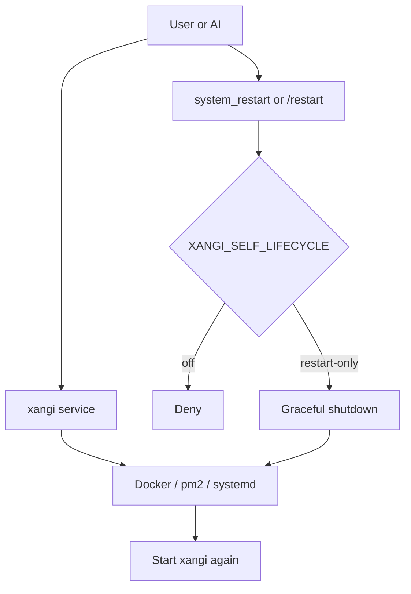

[日本語](../usage.md) | English

# Usage Guide

Detailed usage guide for xangi.

## Table of Contents

- [Basic Usage](#basic-usage)
- [Channel Topic Injection](#channel-topic-injection)
- [Timestamp Injection](#timestamp-injection)
- [Session Management](#session-management)
- [Scheduler](#scheduler)
- [Terminal CLI (xangi)](#terminal-cli-xangi)
- [Chat Operations (xangi tool)](#chat-operations-xangi-tool)
- [Event Trigger](#event-trigger)
- [Runtime Settings](#runtime-settings)
- [Autonomous AI Operations](#autonomous-ai-operations)
- [Docker Deployment](#docker-deployment)
- [Extension Integration](#extension-integration)
- [Remote Platform Adapter](#remote-platform-adapter)
- [Local LLM](#local-llm)
- [Workspace Hooks](#workspace-hooks)
- [Tool Trajectory Logger](#tool-trajectory-logger)
- [Security](#security)
- [Environment Variables Reference](#environment-variables-reference)
- [Running Multiple Instances](#running-multiple-instances)
- [Session Retention](#session-retention)
- [Options](#options)
- [Troubleshooting](#troubleshooting)

## Basic Usage

### Mention to Invoke

```
@xangi your question here
```

### Dedicated Channels

Channels enabled with `/autoreply` will respond without requiring a mention. The setting is persisted in `settings.json`.

## Channel Topic Injection

When a Discord channel has a topic (description) set, its content is automatically injected into the prompt.

This allows you to provide different context or instructions to the AI for each channel.
Messages inside Discord threads inherit the parent channel topic. The conversation session and run lock still use the thread ID, but prompt instructions come from the parent channel.

### How to Configure

Go to Discord channel settings and write natural language instructions in the "Topic" field.

### Examples

- `Always read ~/project/README.md before starting work`
- `Respond in English in this channel`
- `Always search memory-RAG before responding`

If the topic is empty, nothing is injected.

## Timestamp Injection

The current time (JST) is automatically injected at the beginning of the prompt. This helps the AI recognize the passage of time and make time-related decisions more accurately.

Enabled by default. To disable:

```bash
INJECT_TIMESTAMP=false
```

Injection format: `[Current time: 2026/3/8 12:34:56]`

## Session Management

| Command               | Description                                                                    |
| --------------------- | ------------------------------------------------------------------------------ |
| `/new`, `!new`, `new` | Start a new session                                                            |
| `/retitle`            | Regenerate the current Web conversation or Discord thread title using AI      |

### Discord Button Controls

Buttons are displayed on response messages.

- **During processing**: `Stop` / `延長` (Extend) / `⏱ MM:SS` buttons
  - `Stop` — equivalent to `/stop`. Interrupts the task
  - `延長` (Extend) — **doubles the remaining time** (adds residual to the deadline, capped at `TIMEOUT_MAX_MS`)
  - `⏱ MM:SS` — remaining time badge (click does nothing, turns red under 30s)
- **After completion**: `New` resets sessions outside threads. Inside a thread, both Discord and Slack show a leftmost `Close` button that closes the current session. On Slack, it also adds a ✅ reaction to the parent message. `History` shows chronological commentary and tool calls only to the user who clicked it; on Slack, `Close` inside the History view removes only that ephemeral display
- **`Close` in a Discord thread**: closes the current session into history, then removes only the user who clicked it from the thread and from that user's sidebar. The conversation log and Discord thread itself are not deleted. The bot requires the Discord Manage Threads permission

Set `DISCORD_SHOW_BUTTONS=false` to hide buttons.

Reply suggestions are disabled by default. When enabled, Discord and Slack completed messages show only one `返信候補` button. Opening it reveals suggestions and number buttons only to that user; selecting one continues the same session. Web Chat provides the same collapsed control below each response. Discord's `/replysuggestions mode:on|off|show|default` switches the feature globally. OFF skips prompt injection, so no extra suggestion tokens or generation latency are incurred. Set the platform-specific `*_REPLY_SUGGESTIONS=true` variables to enable the feature at startup, and use `*_REPLY_SUGGESTIONS_COUNT` to change the default count of 3.

### Dynamic Timeout Extension

Long-running tasks (code generation, deep research, etc.) can be extended via
the `延長` button before the initial timeout (`TIMEOUT_MS`, default 30 minutes)
fires. The button **doubles the remaining time** at the moment of the click.

- Initial timeout: `TIMEOUT_MS` (default 30 minutes)
- Extension behavior: adds the current remaining time to the deadline → remaining time becomes **2x**
  - e.g. 3 min remaining → click → 6 min remaining
  - e.g. 30 sec remaining → click → 1 min remaining (last-resort recovery)
- Absolute cap: `TIMEOUT_MAX_MS` (default 36000000ms = 10 hours)
  - Adjust it via `TIMEOUT_MAX_MS` to allow longer runs or enforce a tighter cap (e.g. `TIMEOUT_MAX_MS=3600000` = 1h)
- On/off: `TIMEOUT_EXTEND_ENABLED` (default `true`)
  - When `false`, the `延長` button is hidden and `extendTimeout` API returns `unsupported`
- UI:
  - Web Chat — `[延長][⏱ MM:SS]` shown next to the `⏹` button in the composer (only while sending)
  - Discord — `[Stop][延長][⏱ MM:SS]` row on the "Thinking…" message, including turns started by schedules / triggers
  - Slack — same buttons in the Block Kit actions block, including turns started by schedules / triggers
- Display turns red + pulses when under 30 seconds remain
- `延長` is disabled / hidden once the cap is reached

Supported backends: Claude Code (persistent-runner), Codex CLI, Cursor CLI,
Grok CLI, Antigravity CLI, Local LLM, Dynamic Runner (forwards to inner runner).

Programmatic API:

- `GET /api/sessions/:id/timeout` — current state `{active, timeoutAt, maxTimeoutAt, remainingMs, timeoutMs}`
- `POST /api/sessions/:id/timeout/extend` — `{additionalMs?: number}`; when omitted, adds the current remaining time (doubling it)
- `POST /api/sessions/:id/close` — Mark the Session Closed, detach its next-input routing pointer, and destroy its runner while preserving conversation history. To reduce accidental actions, the Web UI exposes it from Monitor details
- Monitor can show completed Sessions from the last 24 hours, 7 days, 30 days, or all history. This defaults to 24 hours and is independent of the `Chat`, `Web`, and `Schedule` toggles

Monitor groups Sessions into `Running`, `Waiting for input`, and `Completed` without exposing the internal Open / Closed lifecycle. A stateless extension backend with no provider-side context appears only while its request is running and leaves Monitor after the response completes; its conversation log remains available in Chat. Completed Sessions are limited to the last 24 hours by default. Errors and aborted turns stay in Waiting and are identified by their status label and colored dot. A completed Session can still continue in its original Discord conversation or branch into a new Web conversation that inherits its history. For conversations originating in Discord or Slack, the platform label in the Chat pane header opens the original channel or thread in the browser. This link remains available after branching into Web. Existing Sessions without an explicit lifecycle are treated as completed until they receive the next input. In Discord threads, `Close` combines completing the Session with removing the requesting user from the thread.

For long, multi-step work, the agent updates a durable plan with the `progress_card` tool. Monitor list cards show the current step and completed-step count; selecting the Session shows every step with textual Pending / Current / Completed states plus an optional note. The card survives page reloads and xangi restarts, and xangi does not infer a percentage. For manual use, check the current contract with `xangi tool help progress_card` instead of guessing flags.

Each Monitor card and its detail panel also show the cumulative wall-clock time spent running agent turns in that Session. The value is persisted with the Session across xangi restarts. `Chat`, `Web`, and `Schedule` are independent toggles, with only `Chat` and `Web` enabled by default. Enabling `Schedule` adds scheduled-run Sessions alongside the other enabled types with the same token and processing-time format. New scheduled-run Sessions use the schedule label instead of the full execution prompt as their title, while long card titles are truncated to one line.

### Agent Run API

Use the Agent Run API to create an isolated Web session when comparing the same task across backends and models. Omitting `workspaceId` selects the default workspace. POST returns HTTP 202 immediately after accepting the run; poll the individual resource until it reaches a terminal state.

```http
POST /api/agent-runs
Content-Type: application/json

{
  "task": "Implement the change and pass the targeted tests",
  "backend": "codex",
  "model": "gpt-5.6-sol",
  "effort": "high",
  "workspaceId": "default"
}
```

- `GET /api/agent-runs` — list runs
- `GET /api/agent-runs/:id` — retrieve a manifest with status, task hash, session IDs, duration, and usage. `trajectoryPath` is included only when the log file was actually created
- Status values are `queued`, `running`, `succeeded`, and `failed`
- The first version does not run acceptance gates, automatic repairs, or aggregate multiple runs

## Scheduler

Set up periodic tasks and reminders. Ask the AI in natural language, and it calls `xangi tool schedule_add` etc. on your behalf.
Scheduled results show elapsed time on both success and failure. Discord, Slack, Telegram, and LINE use a result footer, while Web shows it in the message header.

### How to Operate

| Entry point                 | Description                                                    |
| --------------------------- | -------------------------------------------------------------- |
| `/schedule` (Discord slash) | Add / list / remove / toggle schedules via GUI                 |
| Web UI Schedules            | Add, edit, pause, and delete jobs for every supported platform |
| `xangi tool schedule_*`     | Operate from AI or CLI (see below)                             |
| Natural language            | Say e.g. "remind me at 9am every day" and the AI registers it  |

### Time Specification Formats

#### One-time Reminders

```
30 minutes later, remind me about XX
1 hour later, prepare for the meeting
15:30 notify at 3:30 PM today
```

#### Recurring (Natural Language)

```
Every day 9:00 morning greeting
Every day 18:00 write daily report
Every Monday 10:00 weekly report
Every Friday 17:00 check weekend plans
```

#### Cron Expressions

For more fine-grained control, cron expressions are also supported:

```
0 9 * * * Every day at 9:00
0 */2 * * * Every 2 hours
30 8 * * 1-5 Weekdays at 8:30
0 0 1 * * 1st of every month
```

| Field       | Value | Description             |
| ----------- | ----- | ----------------------- |
| Minute      | 0-59  |                         |
| Hour        | 0-23  |                         |
| Day         | 1-31  |                         |
| Month       | 1-12  |                         |
| Day of Week | 0-6   | 0=Sunday, 1=Monday, ... |

### `xangi tool schedule_*`

Operate schedules directly from the AI or shell. `schedule_add` requires `--channel` so the destination is always explicit. For Web Chat, also pass `--platform web` and the Web session ID. For LINE, pass `--platform line` and the LINE user ID (turns started from LINE fill in the platform and channel automatically).

```bash
# Add a schedule (natural language)
xangi tool schedule_add --input "Every day 9:00 good morning" --channel <channelId>
xangi tool schedule_add --input "30 minutes later, meeting" --channel <channelId>
xangi tool schedule_add --input "15:00 review" --channel <channelId>
xangi tool schedule_add --input "Every Monday 10:00 weekly MTG" --channel <channelId>
xangi tool schedule_add --input "cron 0 9 * * * good morning" --channel <channelId>

# Send to a Web session
xangi tool schedule_add --input "Every day 9:00 status check" --platform web --channel <sessionId>

# Send to LINE
xangi tool schedule_add --input "Every day 7:00 today's plan" --platform line --channel <LINE userId>

# List schedules
xangi tool schedule_list

# Update only the prompt while preserving the ID, timing, destination, and enabled state
xangi tool schedule_update --id <scheduleId> --message "updated task"

# Update timing, type, and prompt together
xangi tool schedule_update --id <scheduleId> --input "startup updated task"

# Change platform and destination together
xangi tool schedule_update --id <scheduleId> --platform slack --channel <channelId>

# Remove by ID
xangi tool schedule_remove --id <scheduleId>

# Enable/disable toggle
xangi tool schedule_toggle --id <scheduleId>
```

`schedule_update` preserves omitted fields. `--input` and `--message` cannot be used together. Use `schedule_toggle` to change the enabled state.

### Data Storage

Schedule data is saved in `${DATA_DIR}/schedules.json`.

- Default: `<WORKSPACE_PATH or process startup directory>/.xangi/schedules.json` (`/workspace/.xangi/schedules.json` in Docker)
- Configurable via the `DATA_DIR` environment variable

## First install without Git

Use the same command on macOS, Linux, and WSL2:

```bash
curl -fsSL https://github.com/karaage0703/xangi/releases/latest/download/install.sh | bash
```

The common `install.sh` detects the operating system and CPU, then selects a target installer from the same GitHub Release. WSL2 follows the Linux path. A `curl ... | bash` invocation installs the verified xangi CLI but always defers AI setup and service activation. After the installer exits, run the printed `xangi setup` command from a normal terminal. Keeping interactive AI TUIs out of the pipe avoids platform-specific terminal initialization failures. A managed install creates `~/.local/bin/xangi`; when that directory is not on PATH, the installer adds it idempotently to the bash or zsh startup files and also prints an `export PATH=...` command for the current shell.

## Terminal CLI (xangi)

`xangi` is a thin terminal client for humans to connect to xangi Web sessions. It consumes the existing Even Terminal compatible API (`/api/sessions`, `/api/prompt`, `/api/messages`, `/api/status`) and does not spawn Claude Code, Codex CLI, or other backends directly. The actual backend / model is resolved by the xangi server or the `XANGI_EVEN_TERMINAL_BACKEND` settings.

`xangi` is the canonical CLI for session, service, and agent-facing tool operations. Agents and integration scripts use `xangi tool <operation>`. The legacy `xangi-cmd <operation>` command remains a compatibility shim backed by the same dispatcher, but new documentation and scripts should use `xangi tool`.

```bash
# Put the development xangi command on PATH
cd ~/xangi-dev
npm link

# Without npm link, for a single clone
mkdir -p ~/.local/bin
ln -sf ~/xangi-dev/bin/xangi ~/.local/bin/xangi

# For multiple clones, prefer named symlinks
ln -sf ~/xangi-dev/bin/xangi ~/.local/bin/xangi-dev
ln -sf ~/xangi-prod/bin/xangi ~/.local/bin/xangi-prod

# List sessions
xangi sessions --url http://127.0.0.1:18888

# Send to a new session and wait for the response
xangi send "Check this repository state"

# Send from stdin
git diff | xangi send -

# Send to an existing session and wait for the response
xangi send --session <sessionId> "Please continue"

# Send only and return the session ID
xangi send --detach "Queue this task for later"

# Interactive REPL
xangi chat --session <sessionId>

# Initial macOS, Linux, or WSL2 setup
xangi setup

# Diagnose config and service health without printing secrets
xangi doctor

# Ask an AI agent independent of the xangi service to investigate, repair, and verify errors
# The agent asks about the symptom first, then prioritizes that path after your reply
xangi rescue

# Print Web UI URLs, bind settings, and Chat/Workspace reachability for the running instance as JSON
xangi tool web_status

# Print the active release or checkout version
xangi --version

# Update from the signed release channel saved by the installer
xangi update

# Explicitly restart the service when you are ready to activate the update
xangi service restart

# Remove the managed app while retaining workspace, settings, tokens, and history
xangi uninstall

# Also remove settings, tokens, and history while retaining the workspace
xangi uninstall --purge --yes

```

`xangi setup` first detects Codex, OpenCode, Claude Code, Cursor Agent, Grok CLI, and Antigravity on `PATH` using deterministic executable and `--version` checks. It asks which detected agent to use, or points to the independent AI tool setup and exits when none are available. Local LLM remains available for normal xangi use, but is not selected to perform the file-editing first-run onboarding.

To set up only an AI coding tool without installing xangi, run this one-liner:

```bash
bash <(curl -fsSL https://github.com/karaage0703/xangi/releases/latest/download/setup-ai-tools.sh) codex
```

Replace the last argument with `codex`, `claude-code`, `cursor`, `grok`, `antigravity`, `github-copilot`, or `opencode`. Use `check` for a read-only status check. Codex uses [OpenAI's official standalone installer](https://learn.chatgpt.com/docs/codex/cli#getting-started) and does not require Node.js or npm. If the Node.js and npm prerequisites for GitHub Copilot CLI are missing, the script displays the nvm installation guide.

For OpenCode, `setup-ai-tools.sh opencode` installs the official CLI and opens OpenCode's authentication flow. The subsequent `xangi setup` lets you keep the existing OpenCode configuration and credentials or configure a local OpenAI-compatible endpoint. The local option stores a private, xangi-owned `opencode.json` without overwriting the normal OpenCode configuration, then applies it through `OPENCODE_CONFIG` and `AGENT_MODEL` only when xangi runs.

The selected agent starts interactively in Japanese and asks one question at a time. Initial setup fixes Web Chat to `local` (loopback only) and does not inspect or modify Tailscale until the minimum workspace setup, service start, and `doctor` checks for config, workspace, backend, service, health, and runtime workspace all succeed. Only after the local setup works does the agent offer `tailscale` (a same-port Tailscale Serve TCP forward inside the tailnet) or `lan` (`0.0.0.0`, after warning that Web Chat has no application-level authentication) as optional settings. `setup --access <local|tailscale|lan>` changes only the Web Chat scope without returning completed onboarding to the bootstrap phase. The Tailscale path configures `tailscale serve --bg --tcp=<PORT> tcp://127.0.0.1:<PORT>` and applies `setup --access tailscale` only after the forward is verified. A failure in this optional step leaves the working local setup intact. Only a short start message appears in the agent UI; the agent reads detailed instructions from a temporary mode-0600 file that is removed when it exits. When no known workspace exists, xangi recommends `ai-assistant-workspace` first. If selected, xangi resolves the GitHub repository's latest `main` commit and downloads that commit's archive without Git. Other blank workspaces and existing workspaces at absolute paths remain available. The agent invokes `xangi setup --apply` with local access after the user decides, but xangi itself validates the absolute path, backend, workspace mode, and Web Chat access; atomically writes the mode-0600 configuration; applies the repository template; and creates a starter BOOTSTRAP.md for a blank workspace. `xangi setup --complete` refuses completion while BOOTSTRAP.md remains. After basic setup, the agent asks whether to start using xangi or continue with optional Web Chat access, Discord, other platforms, schedules, and skills. For these xangi settings it does not search the workspace; it uses xangi's bundled README, `docs/usage.md`, and platform documentation as the source of truth. A checkout runs `service start` and then `doctor`; a managed distribution relies on the installer to activate the OS service and uses `doctor` for verification. Template state records repository, commit SHA, archive SHA-256, and application time; later updates never overwrite the workspace.

There is no browser UI that replaces AI onboarding. Token entry alone uses the local `xangi settings` GUI. When no supported agent is available setup prints the standalone setup command and exits, so rerun `xangi setup` after installing an agent. Linux follows the XDG Base Directory layout and uses a `systemd --user` service. WSL2 requires systemd.

`setup`, `update`, and `doctor` work in both managed distributions and Git checkouts. The common configuration saved by checkout `setup` is loaded by the PM2 service, so `WORKSPACE_PATH` does not need to be duplicated in `.env`. `doctor` checks PM2, Web Chat health, and the actual workspace reported by `/api/sessions`; it exits with an error when that workspace differs from the saved setup.

In a checkout, `./bin/xangi update` first refuses uncommitted changes, detached HEAD, and a branch without an upstream, then runs `git pull --ff-only`, `npm ci`, and `npm run build`. Use `./bin/xangi update --managed` to explicitly invoke the signed managed updater from a checkout.

`xangi update --help` (or `-h`) describes the update behavior and available options for both checkout and managed installations, including that the service is not restarted automatically. Run `xangi service restart` explicitly when you are ready to activate the update.

`xangi --version` (`xangi -V` and `xangi version` are aliases) prints the active signed release for a managed installation, or the Git tag or commit for a checkout.

For a managed installation, `xangi uninstall` removes scheduled updates, the OS service, and the xangi application in that order. It retains the workspace, settings, tokens, and history, so rerunning the printed install command restores the application with the previous configuration. Use `xangi uninstall --purge --yes` only when settings, tokens, and history should also be removed. Without `--yes`, `--purge` exits before deleting anything. Neither mode removes the workspace.

In a development checkout, `./bin/xangi` starts current source through the local `tsx` installed by `npm ci`, preventing an ignored, stale `dist/` tree from surviving a `git pull`. A distribution contains no source tree and uses its bundled `dist` and Node.js runtime; it also bundles the README and user-facing documentation consumed during onboarding.

Enter Discord allowed user IDs, Discord / Slack / LINE / Telegram tokens, and optional AI-provider API keys through `xangi settings`. The temporary GUI binds only to `127.0.0.1`, uses a one-time URL plus Host validation, never returns stored values to the browser, and closes after saving. xangi atomically stores values with mode 0600 in the OS-specific config directory's `secrets.json`. Users do not need to assemble `read` or `printf` commands or paste tokens into an AI conversation. Explicit environment variables remain supported and take precedence.

GitHub Releases publish the common entry point as `install.sh`. `packaging/bootstrap.sh` detects the operating system and CPU, then selects `xangi-installer-<darwin|linux>-<arm64|x64>.sh` from the same release. For a piped invocation it passes `XANGI_INSTALL_DEFER_SETUP=1`, installs only the verified CLI, and separates AI setup plus service activation into a later `xangi setup` command. Each target installer is generated by `packaging/build-installer.mjs` and verifies xangi's Ed25519-signed manifest and artifact. It never extracts an archive before verification and stores the public key plus `releases/latest` update-manifest URL outside versioned application files before committing the verified bundle, `current`, launcher, and `~/.local/bin/xangi`. Setup or service-activation failures keep xangi installed so recovery can continue with `xangi setup` or `xangi install`. Artifact URLs stay pinned to a release version; updates verify the latest manifest signature before downloading a newer artifact. The `setup-ai-tools.sh` release asset installs and authenticates an AI coding tool independently of xangi. Interactive onboarding runs only after the user starts `xangi setup` from a normal terminal, and starts the service after setup completes. A LaunchAgent or systemd user timer then runs `xangi update` every six hours. The workspace template resolves the repository's latest commit when selected, is applied only to an empty workspace once, and is never updated, merged, or overwritten afterward.

Main options:

| Option            | Description                                                                                                                      |
| ----------------- | -------------------------------------------------------------------------------------------------------------------------------- |
| `--version`, `-V` | Print the active release version or the Git tag or commit for a checkout                                                         |
| `--url`           | xangi Web Chat URL. Resolution order: `XANGI_URL`, `XANGI_CLI_URL`, `~/.config/xangi/config.json`, then `http://127.0.0.1:18888` |
| `--token`         | Even Terminal compatible API token. Falls back to `.env`, `XANGI_TOKEN`, `XANGI_EVEN_TERMINAL_TOKEN`, then config                |
| `--provider`      | Even Terminal compatibility label (`claude` / `codex`), not a direct backend selector                                            |
| `--session`       | Web session ID to attach to                                                                                                      |
| `--detach`, `-d`  | Return after sending the prompt and printing the session ID                                                                      |

`send` polls `/api/messages` and prints the final response by default. Use `--detach` only when the command should return immediately.

On startup, the CLI also reads `XANGI_ENV_PATH`, `XANGI_DIR/.env`, and the current directory's `.env`. When running from `~/xangi-dev`, you normally do not need to pass `--token` manually.

If `~/.local/bin` is not on PATH, add `export PATH="$HOME/.local/bin:$PATH"` to your shell config.

Example config:

```json
{
  "url": "http://127.0.0.1:18888",
  "token": "your-token",
  "provider": "codex",
  "sessionId": "optional-default-session"
}
```

## Chat Operations (xangi tool)

The AI performs Discord / Slack operations via the `xangi tool` CLI tool. Because it routes through xangi's built-in tool-server (HTTP API), secrets like `DISCORD_TOKEN` / `SLACK_BOT_TOKEN` are never accessible to the AI CLI.

The persistent system prompt does not embed every command example. When the AI needs current syntax, it uses `xangi tool help`, `xangi tool help <topic>`, or `xangi tool help <command>`. Topics are `discord`, `slack`, `web`, `schedule`, `models`, `trigger`, `system`, and `local`. Each platform's `/help` remains the source of truth for user-facing slash commands.

| Command                                                                          | Description                                                                                                                 |
| -------------------------------------------------------------------------------- | --------------------------------------------------------------------------------------------------------------------------- |
| `xangi tool discord_history --channel <ID> [--count N] [--offset M]`             | Get channel history                                                                                                         |
| `xangi tool discord_message --channel <ID> --message-id <ID>`                    | Get one message without truncating its content                                                                              |
| `xangi tool web_history [--session <id>] [--count N]`                            | Web Chat current pane history (auto-resolves from `XANGI_CHANNEL_ID=web-chat:<id>`)                                         |
| `xangi tool web_status`                                                          | Get Web UI URLs, bind/port settings, and Chat/Workspace HTTP status for the running instance as JSON                        |
| `xangi tool slack_history [--channel <id>] [--count N]`                          | Slack current channel history (auto-resolves from `XANGI_CHANNEL_ID=<channel>`)                                             |
| `xangi tool discord_send --channel <ID> --message "text"`                        | Send a message                                                                                                              |
| `xangi tool discord_channels --guild <ID>`                                       | List channels                                                                                                               |
| `xangi tool discord_search --channel <ID> --keyword "text"`                      | Search messages                                                                                                             |
| `xangi tool discord_edit --channel <ID> --message-id <ID> --content "text"`      | Edit a message                                                                                                              |
| `xangi tool discord_delete --channel <ID> --message-id <ID>`                     | Delete a message                                                                                                            |
| `xangi tool discord_thread_leave --user <ID> [--channel <ID>]`                   | Remove a user from a thread = drop it from that user's sidebar (defaults to the current thread when `--channel` is omitted) |
| `xangi tool media_send --channel <ID> --file /path/to/file`                      | Send a file                                                                                                                 |
| `xangi tool slack_send --channel <id> --message "text" [--thread-ts <ts>]`       | Send a Slack message                                                                                                        |
| `xangi tool slack_channels [--types public_channel,private_channel] [--limit N]` | List Slack channels                                                                                                         |
| `xangi tool slack_search --channel <id> --keyword "text" [--count N]`            | Search Slack messages                                                                                                       |
| `xangi tool slack_edit --channel <id> --message-ts <ts> --content "text"`        | Edit a Slack message                                                                                                        |
| `xangi tool slack_delete --channel <id> --message-ts <ts>`                       | Delete a Slack message                                                                                                      |

On Slack, when `SLACK_REACTION_DELETE_ENABLED=true` (default) and the Slack App subscribes to the `reaction_added` event with the `reactions:read` scope, an allowed user can delete a bot message by adding a `:wastebasket:` or `:x:` reaction. Customize the reaction names with `SLACK_DELETE_REACTIONS=wastebasket,x`.

### Examples

```bash
# Get channel history
xangi tool discord_history --count 10
xangi tool discord_history --channel 1234567890 --count 10
xangi tool discord_history --channel 1234567890 --count 30 --offset 30  # scroll back
xangi tool discord_message --channel 1234567890 --message-id 111222333  # get the full message selected from history

# Send a message to another channel
xangi tool discord_send --channel 1234567890 --message "Work completed!"

# List channels
xangi tool discord_channels --guild 9876543210

# Search messages
xangi tool discord_search --channel 1234567890 --keyword "PR"

# Slack operations
xangi tool slack_send --channel C01234567 --message "Work completed!"
xangi tool slack_send --channel C01234567 --thread-ts 1719876543.000100 --message "Thread reply"
xangi tool slack_channels --types public_channel,private_channel --limit 100
xangi tool slack_search --channel C01234567 --keyword "PR" --count 15
```

If `--channel` is omitted while running inside xangi, the current channel ID is used automatically. When running the CLI standalone, `--channel` is required.

```bash
# Edit and delete messages
xangi tool discord_edit --channel 1234567890 --message-id 111222333 --content "updated content"
xangi tool discord_delete --channel 1234567890 --message-id 111222333

# Remove a user from a thread = drop it from that user's sidebar (omit --channel to target the current thread)
xangi tool discord_thread_leave --user 111222333
xangi tool discord_thread_leave --user 111222333 --channel 1234567890
xangi tool slack_edit --channel C01234567 --message-ts 1719876543.000100 --content "updated content"
xangi tool slack_delete --channel C01234567 --message-ts 1719876543.000100
```

### Tool Server

`xangi tool` relays requests to the tool-server (HTTP API) running inside the xangi process.

- Port is assigned automatically by the OS (no conflicts when running multiple instances)
- xangi injects `XANGI_TOOL_SERVER` into child processes at startup
- `xangi tool` uses `XANGI_TOOL_SERVER` to resolve the connection endpoint
- If `XANGI_TOOL_SERVER` is missing, the command fails instead of guessing a target instance
- Runtime context such as the current channel ID is passed to the tool-server as `context`

Multiple instances on the same machine remain isolated because each xangi process injects its own `XANGI_TOOL_SERVER` into its child processes. External scripts must explicitly provide the endpoint of the intended instance.

## Event Trigger

You can start an agent turn from an external event (build finished, CI result, new content detected, etc.). This replaces polling (periodic schedule checks) with push (wake only when something happened), improving responsiveness and eliminating wasted turns.

### Enabling

Add the following to `.env` (disabled by default):

```bash
TRIGGER_ENABLED=true
XANGI_TRIGGER_TOKEN=<long random string>   # e.g. openssl rand -hex 32
# TRIGGER_MIN_INTERVAL_MS=10000            # minimum interval per source (default: 10s)
```

The token is mandatory. If `XANGI_TRIGGER_TOKEN` is not set, all HTTP requests are rejected even with `TRIGGER_ENABLED=true` (the tool-server is exposed on the network, so accepting unauthenticated requests would allow arbitrary prompt injection).

### Firing via HTTP

```bash
curl -X POST "$XANGI_TOOL_SERVER/api/trigger" \
  -H "Authorization: Bearer $XANGI_TRIGGER_TOKEN" \
  -H "Content-Type: application/json" \
  -d '{
    "channel": "<channel ID>",
    "message": "docker build finished. Check the result and report.",
    "source": "docker-build"
  }'
```

- `channel` (required): channel ID where the turn runs and results are posted
- `message` (required): instruction for the agent (max 4000 chars)
- `source` (optional): identifier of the event origin (alphanumerics plus `_.:-`, max 64 chars). Used as the display label and the rate-limit key
- `platform` (optional): `discord` (default), `slack`, `telegram`, `web`, or `line`

On success it returns `202 { "ok": true, "triggerId": "trg_..." }` immediately (it does not wait for the turn to finish). Discord, Slack, and Telegram receive a `⚡ trigger: <source>` label followed by the agent response. Web accepts either `web-chat:<sessionId>` or the raw `sessionId` and appends a new turn to that Web conversation.

The returned ID can be used to query a platform-neutral execution and delivery receipt. `status` is one of `accepted`, `running`, `completed` (turn completed without a delivery reference), `delivered`, `failed`, or `interrupted` (xangi restarted before completion). Delivered receipts contain Discord / Slack / Telegram message IDs or a Web session ID in `delivery`. The latest 1,000 receipts are stored in `${DATA_DIR}/trigger-receipts.json` and remain queryable after restart.

```bash
curl "$XANGI_TOOL_SERVER/api/trigger/<triggerId>" \
  -H "Authorization: Bearer $XANGI_TRIGGER_TOKEN"
```

### Firing via xangi tool

Local scripts can also fire a trigger via `xangi tool` (no token needed; `TRIGGER_ENABLED=true` is still required):

```bash
xangi tool trigger --channel <channel ID> --message "Build finished. Report the result." --source build
xangi tool trigger_status --id <triggerId>
```

When `TRIGGER_ENABLED=true`, the system prompt injects only the safety contract: persist the exit status and log, then fire the trigger on both success and failure. Detailed arguments come from `xangi tool help trigger`, while each workspace remains the source of truth for its launch and verification method.

### Abuse protection

- Repeated fires from the same `source` within `TRIGGER_MIN_INTERVAL_MS` (default 10s) are rejected (`429`)
- While a turn for the same `source` is running, new fires are rejected (`409`)

## Runtime Settings

Runtime settings are saved in `${DATA_DIR}/settings.json` (default: `${WORKSPACE_PATH}/.xangi/settings.json`).

```json
{
  "discordAutoReplyChannels": {
    "123456789012345678": true
  },
  "slackAutoReplyChannels": {
    "C01234567": true
  },
  "discordCompletionNotifyChannels": {
    "123456789012345678": "mention"
  },
  "discordThreadModeChannels": {
    "123456789012345678": true
  }
}
```

| Setting                           | Description                                                                   | Default |
| --------------------------------- | ----------------------------------------------------------------------------- | ------- |
| `discordAutoReplyChannels`        | Per-channel mention-free auto-reply settings (`true` / `false`)               | none    |
| `slackAutoReplyChannels`          | Per-Slack-channel mention-free auto-reply settings (`true` / `false`)         | none    |
| `discordCompletionNotifyChannels` | Per-channel completion notification overrides (`off` / `message` / `mention`) | none    |
| `discordThreadModeChannels`       | Per-channel Discord thread reply overrides (`true` / `false`)                 | none    |

### Viewing and Changing Settings

| Command                                          | Description                                                                                                           |
| ------------------------------------------------ | --------------------------------------------------------------------------------------------------------------------- |
| `/settings`                                      | Show current settings                                                                                                 |
| `/models [backend]`                              | List available models (all allowed backends when omitted)                                                             |
| `/restart`                                       | Restart the bot only when `.env` has `XANGI_SELF_LIFECYCLE=restart-only`                                              |
| `/autoreply <on\|off\|default\|show>`            | Configure mention-free auto-reply for this channel (no restart needed, persisted to `settings.json`)                  |
| `/notify <off\|message\|mention\|default\|show>` | Configure completion notifications for this channel (no restart needed, persisted to `settings.json`)                 |
| `/respondtobots`                                 | Toggle bot-to-bot reply ON/OFF (whitelist set via `RESPOND_TO_BOTS` env)                                              |
| `/threadmode <on\|off\|default\|show>`           | Show or toggle this channel's Discord per-message thread reply mode (no restart needed, persisted to `settings.json`) |
| `/llmmode <agent\|chat\|default\|show>`         | Switch this channel's Local LLM operation mode (persisted to `CHANNEL_OVERRIDES` in `.env`)                           |
| `/llmeffort <none\|minimal\|low\|medium\|high\|xhigh\|max\|default\|show>` | Switch this channel's Local LLM `reasoning_effort` (persisted to `.env`) |

### Backend Dynamic Switching

You can switch the backend, model, and effort level per channel.

| Command                                          | Description                               |
| ------------------------------------------------ | ----------------------------------------- |
| `/backend show`                                  | Show the current backend and model        |
| `/backend set claude-code`                       | Switch to Claude Code                     |
| `/backend set cursor`                            | Switch to Cursor CLI                      |
| `/backend set grok`                              | Switch to Grok CLI                        |
| `/backend set local-llm --model nemotron-3-nano` | Switch to Local LLM with a specific model |
| `/backend set claude-code --effort high`         | Switch with a specific effort level       |
| `/backend set codex --effort max`                | Run Codex with max effort                 |
| `/backend set grok --effort max`                 | Run Grok with max effort                  |
| `/backend set antigravity --effort high`         | Run Antigravity with high effort          |
| `/backend set github-copilot --effort high`      | Run GitHub Copilot CLI with high effort   |
| `/backend reset`                                 | Reset to the default (.env settings)      |
| `/backend show scope:global`                     | Show the process-wide backend/model/effort default |
| `/backend set codex model:gpt-5.6-sol effort:medium scope:global` | Change the process-wide default for subsequent turns |
| `/backend reset scope:global`                    | Clear the explicit process-wide model and effort |

Switching always starts a new session (conversation history is not carried over).
It is available on both Discord and Slack. For Slack, register `/backend` in the app settings
with the Usage Hint `show|set <backend> [--model <model>] [--effort <effort>] [--scope channel|global]|reset`.
The setting is persisted in `CHANNEL_OVERRIDES` by channel ID and applies to threads in that
channel from the next message without restarting xangi.
`scope:global` (`--scope global` on Slack) updates `AGENT_BACKEND` / `AGENT_MODEL` / `AGENT_EFFORT` and the live default runner together. An effort is saved only when the selected model supports it. Active turns finish on their previous runner; subsequent turns use the new default. Explicit channel overrides remain unchanged.

`/models [backend]` is shared by Discord, Slack, Web, Telegram, and LINE. Without an argument it checks every backend in `ALLOWED_BACKENDS`; with an argument it checks only that backend. It is read-only and does not change the current backend or model.

`/models` dynamically reads the models available to the current account from each CLI's official discovery interface. It uses Codex `app-server model/list`, `cursor-agent models`, `grok models`, `opencode models`, and Agy 1.1.12 or later `agy --output-format json models`. If an older Agy explicitly rejects `--output-format`, xangi falls back to `agy models` and accepts both tab-delimited and legacy one-column output. Local LLM discovery uses Ollama `/api/tags` or the OpenAI-compatible `/v1/models` endpoint. A backend without an independent machine-readable discovery command, such as Claude Code or GitHub Copilot CLI, is reported as unsupported; xangi does not fill the gap with a hard-coded model list.

In the Web slash-command palette, selecting a backend for `/backend set` loads model choices from the same dynamic discovery result. Selecting a model then shows the effort choices supported by that backend/model combination. Web Project settings use the same model and effort discovery.

Discord `/backend set` also displays model and effort as autocomplete choices. Model choices use the selected backend's dynamic discovery result; effort choices include only values supported by both the selected backend and model.

When a user asks about model availability in natural language, the system prompt also instructs the agent to measure it first through this read-only command:

```bash
xangi tool models --backend codex
xangi tool models --backend codex --use gpt-5.4 --effort high
```

For natural-language setting changes, the agent uses `runtime_settings` rather than executing an arbitrary slash-command string. It accepts structured and validated `show` / `set` / `reset` actions for `backend`, `llmmode`, `autoreply`, `notify`, `threadmode`, `replysuggestions`, and `respondtobots`, then writes through the same persistence path as the native commands. In a Discord thread, pass the parent channel ID via `--channel`.

```bash
xangi tool runtime_settings --name autoreply --action set --value on
xangi tool runtime_settings --name backend --action set --backend codex --model gpt-5.4 --effort high
xangi tool runtime_settings --name backend --action set --backend codex --model gpt-5.6-sol --effort medium --scope global
xangi tool runtime_settings --name llmmode --action set --value chat
```

Lifecycle and arbitrary-execution commands such as `/restart`, `/stop`, `/new`, `/schedule`, and `/skill` are intentionally excluded. After changing the backend, model, or effort, the next turn does not reuse a provider session created under the previous configuration.

#### Restricting via Environment Variables

```bash
# Allowed backends for switching (if unset, all backends are allowed)
ALLOWED_BACKENDS=claude-code,codex,cursor,grok,antigravity,github-copilot,opencode,local-llm

# Per-channel backend overrides (JSON)
CHANNEL_OVERRIDES={"channelId":{"backend":"local-llm","model":"nemotron-3-nano"}}
```

#### Persistence

Settings changed with `/backend set` are automatically saved to `CHANNEL_OVERRIDES` in `.env` and persist across restarts.
Inside Discord threads, `/backend`, `/llmmode`, and `/llmeffort` read and write the parent channel's `CHANNEL_OVERRIDES`. Conversation sessions and run locks remain isolated by thread ID; only backend/model settings inherit from the parent channel.

In a Docker environment, `.env` lives outside the container and cannot be modified by the AI (Claude Code, etc.).

### Per-channel workspaces

Discord and Slack can select a working directory per channel. Threads inherit the parent channel binding. A binding change never rewrites an existing session; it takes effect for the next session after `/new`.

| Command                                 | Description                                            |
| --------------------------------------- | ------------------------------------------------------ |
| `/workspace show`                       | Show the channel binding and current session workspace |
| `/workspace list`                       | List registered workspaces                             |
| `/workspace set <name> <absolute-path>` | Register an absolute path and bind it to the channel   |
| `/workspace use <name>`                 | Bind an existing workspace to the channel              |
| `/workspace reset`                      | Return to the startup `WORKSPACE_PATH`                  |

Discord exposes the arguments as slash-command fields. Add a `/workspace` Slash Command to the Slack App configuration as well. By default, any existing absolute path accessible to the xangi process can be registered. Set `XANGI_WORKSPACE_ALLOWED_ROOTS` only when registration must be restricted to explicit roots. Paths are canonicalized and the xangi state directory is rejected. Docker can switch only to container paths that were mounted in advance; an unmounted host path is not accessible.

In the Web UI, use `Add Workspace` on the Projects screen to register an existing absolute path accessible to the xangi process. Unregistering removes only the registry entry and never deletes its directory or files. The default workspace and any workspace referenced by a Project, an existing conversation, or a Discord, Slack, or other channel binding cannot be unregistered.

Web Projects also select a registered workspace. A new Web session snapshots the Project workspace when the session is created, so changing a Project or channel binding never moves an existing conversation to another directory. The Workspace editor provides the same registered-workspace selector.

#### effort Option

Effort choices are the intersection of the backend CLI range and any discovered model-specific metadata. Codex uses app-server `supportedReasoningEfforts`, GitHub Copilot uses the same metadata from its official SDK, OpenCode uses the variants returned by `models --verbose`, and Grok uses the CLI-generated model cache. When a Cursor or Antigravity model ID already includes `low`, `medium`, `high`, `xhigh`, `max`, or another standard effort, xangi offers only that value and does not send a duplicate CLI override. Cursor `auto` cannot have an effort. Claude Code has no machine-readable model catalog, so xangi displays its current CLI-wide range: `low`, `medium`, `high`, `xhigh`, and `max`.

When model-specific metadata is unavailable, xangi falls back to the backend range. Codex supports `low`, `medium`, `high`, `xhigh`, `max`, and `ultra`; OpenCode and Cursor use the superset `none`, `minimal`, `low`, `medium`, `high`, `xhigh`, and `max`; Grok and GitHub Copilot use `low`, `medium`, `high`, `xhigh`, and `max`; and Antigravity uses `low`, `medium`, and `high`. OpenCode variant names depend on the model, provider, and user configuration, so models with verbose metadata expose only standard effort names that actually exist. Local LLM reasoning effort is separate from CLI backend effort and is configured with `/llmeffort`; xangi sends it as the top-level OpenAI-compatible `reasoning_effort` field. Supported values are `none`, `minimal`, `low`, `medium`, `high`, `xhigh`, and `max`, and the selected endpoint must implement the value. `default` removes the channel override and falls back to `LOCAL_LLM_REASONING_EFFORT` or the provider default. Because Claude Code persistent mode requires a process restart, switching resets the session.

## Autonomous AI Operations

### Configuration Changes (Local Execution Only)

The AI can edit the `.env` file to change settings:

```
"Please respond in this channel too"
→ AI saves the equivalent `/autoreply` setting to `settings.json`
```

Use `/autoreply mode:on|off|default|show` to inspect or configure mention-free auto-reply for this channel while the bot is running (no restart needed, persisted to `settings.json`). `default` removes the channel setting and falls back to OFF normally, or to the parent channel value inside a thread.
When run inside a thread, it targets that thread instead of the parent channel. A thread without its own setting inherits the parent channel value, so you can keep a channel OFF while turning a single thread ON, or the other way around.
To disable this command, set `ALLOW_AUTOREPLY_COMMAND=false` in `.env` (default: enabled).

Use `/threadmode mode:on|off|default|show` to inspect or toggle this channel's Discord per-message thread reply mode while the bot is running (no restart needed, persisted to `settings.json`). `default` removes the channel override and falls back to the global `DISCORD_REPLY_IN_THREAD` default.
For messages received inside an existing Discord thread, xangi automatically injects the thread starter message as `🧵 スレッド元`. This keeps the original parent-channel starter message available even when thread-local history does not include it.
Thread prompts always include both the parent channel name/ID and thread name/ID, allowing the agent to distinguish and target either destination without another lookup.
Inside Discord threads, `/notify`, `/threadmode`, and channel topic injection target the parent channel settings. `/autoreply` is configured per thread and falls back to the parent channel value only when the thread has no setting of its own.
To disable this command, set `ALLOW_THREAD_MODE_COMMAND=false` in `.env` (default: enabled).

Use `/notify` to configure separate completion notifications for long Discord turns per channel. `DISCORD_COMPLETION_NOTIFY` is the startup default, while channel overrides are stored in `settings.json`. This applies only to normal Discord message turns; scheduler-triggered turns do not send completion notifications.

Every platform uses the same `✅ 完了（⏱ 1分01秒）` completion display. Elapsed time can be hidden in settings. Normal LINE and Telegram turns use a 10-second default threshold, Discord and Slack keep their platform thresholds, and Web and scheduled runs show the value with each result.

### Responding to Other Bots (A/B Comparison)

By default, messages from other bots are ignored. Set the whitelist in `RESPOND_TO_BOTS` and toggle the feature with `RESPOND_TO_BOTS_ENABLED` or the `/respondtobots` command.

```
# Whitelist (preset)
RESPOND_TO_BOTS=*                       # all bots
RESPOND_TO_BOTS=1469919453155164160     # specific bot only

# Feature ON/OFF
RESPOND_TO_BOTS_ENABLED=true            # ON
RESPOND_TO_BOTS_ENABLED=false           # OFF (default)

# Consecutive-reply cap (default 3, 0 to disable)
RESPOND_TO_BOTS_MAX_CONSECUTIVE=3
```

The bot's own ID is always excluded (infinite-loop prevention). Messages from allowed bots bypass the `DISCORD_ALLOWED_USER` check.

Consecutive replies to the same bot are capped at `RESPOND_TO_BOTS_MAX_CONSECUTIVE` (default 3). The counter resets when a human or a different bot posts. This is a safety net against runaway bot-to-bot loops.

`/respondtobots` toggles the feature ON/OFF dynamically and persists to `.env`. To disable this command, set `ALLOW_RESPOND_TO_BOTS_COMMAND=false` in `.env` (default: enabled).

Use case: run multiple xangi instances (e.g. xangi-prod=Claude / xangi-dev=Local LLM) in the same channel and compare their responses to the same prompt side-by-side.

#### Constraints / Known Limitations

- Responding to bot messages still requires the normal gate: **mention / DM / channel enabled via `/autoreply`**. Whitelisting a bot via `RESPOND_TO_BOTS` does not make it reply across all channels. To test bot-to-bot replies, enable `/autoreply` in the test channel.
- `xangi tool discord_send` always sends with `allowed_mentions: { parse: [] }` to suppress notifications. As a result, mentions (`<@user_id>` / `<@&role_id>` / `@everyone`) embedded in messages sent via `xangi tool` are _not_ parsed into `message.mentions` on the receiving side (Discord-spec behaviour). Mention-based triggers from another bot using `xangi tool discord_send` will therefore not fire.
- Lifting that mention suppression would require an opt-in flag on `xangi tool discord_send` (out of scope of this feature).

### Message Split Separator

When the AI's response text contains `\n===\n` (i.e. `===` surrounded by newlines), the response is split and sent as separate messages. This works not only for scheduler-triggered responses but also for direct Discord and Slack messages. It is useful when you want to generate multiple independent posts from a single LLM response.

```
Post explanation 1
> Post content...

===
Post explanation 2
> Post content...
```

The above response is sent as two separate messages to Discord or Slack. When action buttons are enabled, they appear only on the final message.

### Restart Mechanism

`xangi service start|stop|restart|status` and `xangi service autostart enable|disable` have the same actions in managed and checkout installations. Managed installations control the OS service, while checkouts control PM2. `stop` temporarily stops the service without removing an existing automatic-start registration, and `start` runs it again. `autostart enable` registers startup after login or reboot, while `autostart disable` removes that registration without stopping the currently running xangi process. `xangi install` and `service start` never enable it implicitly. In a checkout, the target is the process named by `XANGI_PROCESS_NAME` in that clone's `.env`.

`xangi service restart` and `xangi tool system_restart` use the new CLI to validate the production Web Project state read-only before requesting a restart. If an unavailable backend or another incompatible state would cause a problem after restart, the command blocks the restart without modifying the state file. At startup, one invalid Project is isolated instead: unavailable backend/model/effort settings are disabled and the remaining Projects and xangi continue starting.

`/restart` and `xangi tool system_restart` are low-level operations that ask the running xangi process to gracefully shut down. The external supervisor, such as Docker, pm2, or systemd, is responsible for starting xangi again.

To restart the xangi instance handling the current conversation, call `xangi tool system_restart` directly instead of delegating a delayed restart to a child process or scheduler. A successful response means that the restart request was accepted; confirm completion from the new process status, start time, and startup log. To operate a different clone, run that clone's `./bin/xangi service restart` directly and wait for completion.

Self restart permission is configured by the administrator in `.env` with `XANGI_SELF_LIFECYCLE`. It is not a runtime setting that the AI changes. Shutdown cannot be guaranteed from inside xangi itself, so stopping xangi is handled by the external lifecycle manager such as Docker, pm2, or systemd.



- `off`: deny xangi-initiated restart
- `restart-only`: allow xangi-initiated restart only
- Self shutdown is handled by the external supervisor / lifecycle manager, not by xangi itself
- **Docker**: Automatically recovers with `restart: always`
- **Local**: Requires a process manager like pm2
- Changing `.env` requires restarting the xangi process

```bash
# Example with pm2
./bin/xangi service start
./bin/xangi service status
./bin/xangi service restart
./bin/xangi service stop
```

To start xangi automatically after login or an OS reboot, explicitly run the following once. Use `xangi` for a managed installation or the target clone's `./bin/xangi` for a checkout:

```bash
xangi service start
xangi service autostart enable
```

Run `xangi service autostart disable` to remove automatic startup. In managed installations this only adds or removes the macOS LaunchAgent or Linux systemd user-service startup registration. In checkouts, enabling runs `pm2 save` and `pm2 startup`, while disabling runs `pm2 unstartup`. If PM2 prints a `sudo ...` command, run it once.

When running multiple clones, run `./bin/xangi service ...` from the target clone. If you want commands on PATH, prefer named symlinks such as `xangi-dev` / `xangi-prod` instead of one generic `xangi` symlink.

```bash
ln -sf /home/user/xangi-dev/bin/xangi ~/.local/bin/xangi-dev
ln -sf /home/user/xangi-prod/bin/xangi ~/.local/bin/xangi-prod

xangi-dev service status
xangi-prod service restart
```

`--dir <xangi-dir>` is an escape hatch for controlling another clone from a PATH-level `xangi`. For day-to-day operations, use the target clone's `./bin/xangi` or a named symlink.

`ecosystem.config.cjs` is a PM2 app definition file. It uses `.env`'s `XANGI_PROCESS_NAME` as the PM2 process name, falling back to `XANGI_INSTANCE_ID` and then the directory name. It also defines the script and `node --env-file=.env` arguments. `./bin/xangi service start` uses this config to ask PM2 to start xangi. The `.cjs` extension keeps the PM2 config in CommonJS (`module.exports`) even though this package uses ESM (`"type": "module"`).

### Changing Environment Variables with pm2

xangi loads environment variables via `node --env-file=.env`. To change environment variables, **edit the `.env` file and then run `./bin/xangi service restart`**.

```bash
# Correct method: edit .env then restart
vim .env  # Add TIMEOUT_MS=60000
./bin/xangi service restart
```

> **Warning: Do not use `pm2 restart --update-env`!**
> `--update-env` saves all shell environment variables to pm2. If you're running multiple xangi instances, another instance's `DISCORD_TOKEN` etc. may leak in, causing dual login with the same bot token.
> `node --env-file=.env` does not overwrite existing environment variables, so values set by pm2 take precedence.

## Docker Deployment

Run in a container-isolated environment. Three containers are available:

| Container   | Dockerfile       | Purpose                                                                     |
| ----------- | ---------------- | --------------------------------------------------------------------------- |
| `xangi`     | `Dockerfile`     | Lightweight (Claude Code / Codex / Cursor CLI / Grok CLI / Antigravity CLI) |
| `xangi-max` | `Dockerfile.max` | Full version (uv + Python support, for Local LLM)                           |
| `xangi-gpu` | `Dockerfile.gpu` | GPU version (CUDA + PyTorch, for image generation / audio processing)       |

### Claude Code Backend

```bash
docker compose up xangi -d --build

# Claude Code authentication
docker compose exec xangi claude
```

`docker-compose.yml` sets `restart: unless-stopped`. Unless you explicitly stop the service with `docker compose stop` / `docker compose down`, the xangi container will be restored when the Docker daemon starts. To start xangi after an OS reboot, enable auto-start for the Docker daemon on the host.

To run Claude Code with Anthropic API-key billing, set `ANTHROPIC_API_KEY` in `.env`.
This value is passed only to the Claude Code child process and is not part of the general safe environment whitelist.
Set `CLAUDE_CODE_BARE=true` when you want to force API-key auth instead of OAuth/keychain auth.
Set `CLAUDE_CODE_MAX_BUDGET_USD` to cap API spend for each Claude Code print-mode run.

```env
AGENT_BACKEND=claude-code
ANTHROPIC_API_KEY=sk-ant-...
CLAUDE_CODE_BARE=true
CLAUDE_CODE_MAX_BUDGET_USD=0.25
```

### Local LLM Backend (Ollama)

An Ollama container is included, so there's no need to install Ollama on the host.

```bash
# Configure .env
AGENT_BACKEND=local-llm
LOCAL_LLM_MODEL=nemotron-3-nano

# Start (ollama + xangi-max)
docker compose up xangi-max -d --build
```

### GPU Version (CUDA + Python + PyTorch)

PyTorch (CUDA-enabled) is available and also works on DGX Spark (ARM64).

```bash
# Start (xangi-gpu + ollama)
docker compose up xangi-gpu -d --build

# Claude Code authentication
docker compose exec xangi-gpu claude

# Verify GPU
docker compose exec xangi-gpu python3 -c "import torch; print(torch.cuda.is_available())"
```

> **Tip**: `xangi-gpu` is a superset of `xangi-max`. Use this when you need skills that require GPU/PyTorch (speech transcription, image generation, etc.).

### Docker Operations

```bash
# Stop
docker compose down

# Restart (e.g. after .env changes)
docker compose up xangi-max -d --force-recreate

# Check logs
docker compose logs -f xangi-max
```

`docker compose down` explicitly stops and removes the container, so it will not come back until you run `docker compose up ... -d` again. If you only want to pause it, use `docker compose stop`; resume with `docker compose start`.

### Workspace Mounting

| Environment | Variable          | Description                                                  |
| ----------- | ----------------- | ------------------------------------------------------------ |
| Local       | `WORKSPACE_PATH`  | Path used directly by the agent                              |
| Docker      | `XANGI_WORKSPACE` | Host-side path (mapped to `/workspace` inside the container) |

For Docker deployment, set `XANGI_WORKSPACE` in `.env`:

```bash
XANGI_WORKSPACE=/home/user/my-workspace
```

> **Warning: Do not use `WORKSPACE_PATH`.** It may conflict with host shell environment variables.

### Security

- Containers do **not have direct access** to the host network
- The Ollama container is isolated within the same docker network
- Environment variables passed to the AI agent are restricted via a whitelist (e.g. `DISCORD_TOKEN` is not accessible)

## Extension Integration

Add and manage external extensions from Extensions in the Web UI. Installation, configuration, stored data, standalone UI, and update instructions remain canonical in each extension repository instead of being duplicated in xangi documentation.

Managed extension status reports `running`, `healthy`, and `ready` separately. `running` means the child process is alive, `healthy` means its health endpoint returned 2xx, and `ready` means that 2xx payload did not explicitly contain `ready: false`. Legacy extensions that omit `ready` are treated as ready. If the initial health probe times out, returns non-2xx, or reports `ready: false` during a cold start, xangi keeps the validated child running so later `status` / `doctor` calls can observe recovery. `doctor` does not succeed until the extension is ready.

Every managed child receives the parent xangi `XANGI_EXTENSION_INSTANCE_ID`. When Web Chat is enabled it also receives `XANGI_EXTENSION_HOST_URL`, and when event delivery is enabled it receives `XANGI_EXTENSION_EVENTS_URL`. Event-consuming extensions can therefore connect to the current instance without guessing its port or bind host. URLs for unavailable endpoints are omitted. These values are parent-owned runtime context, not user-configurable `.env` settings.

xangi-search is visible in the official catalog on a first run. Listing the entry does not fetch or execute its repository; after Add is selected, xangi pins and validates the public repository and starts a dedicated setup conversation. Users may still enter any public GitHub repository URL or configure trusted local development manifests.

An extension linked earlier through the CLI or deployment tooling still shows Setup while it is available. Selecting it opens the dedicated conversation from the repository setup document without stopping or reinstalling the extension. When the setup document contains a setting, workspace change, or optional feature that requires approval, the LLM presents the material difference, impact, and choices instead of deferring them to a generic recommendation or future request. It does not make the change before approval or report setup as complete while a choice remains pending. After setup, status, and doctor checks succeed, the LLM reads the extension README and relevant signals from the current workspace README, AGENTS.md, and top-level directory structure. It then proposes two or three uses matched to the user's goals and existing workflow. Each proposal includes why it fits, the first request or action to try, and the expected result. Recommendations alone do not modify the workspace or settings, and automation, external sending, or scheduled execution still requires separate confirmation.

Selecting Remove on the Extensions page opens a dedicated `Remove: <displayName>` conversation instead of stopping and unlinking immediately. The LLM reads the repository setup document and README, then inspects the current workspace for extension-specific hooks, skills, `AGENTS.md` rules, schedules, and other settings. Before changing anything, it presents the exact paths or IDs, what would be removed or retained, and the impact. The user chooses whether to remove confirmed workspace integrations or retain workspace changes and only stop and unlink the extension. Only after approval does the LLM apply a minimal workspace diff and invoke a fixed tool owned by the current xangi parent process. The tool stops and unlinks the extension, verifies the registry and runtime state, and returns completion, hook reload timing, and restart requirements without using an arbitrary CLI from `PATH`. Downloaded source, extension-owned data, indexes, settings, and facts remain in place during a normal removal; a full purge requires a separate explicit confirmation. The low-level `DELETE /api/extensions/:id` remains available for automation and compatibility and only stops and unlinks.

Extensions added from a public GitHub repository show Check for updates when their manifest declares `update.prepare`. Selecting it resolves the latest default-branch commit and opens a dedicated `Update: <displayName>` conversation. The conversation explains the installed and target commits, then invokes a fixed update tool owned by the xangi parent process. The tool revalidates the target commit, stops the extension, swaps the source, runs its update preparation, relinks, starts, and runs `doctor`. On failure it restores the previous source and, if the extension was running before the update, restarts and doctors that version. Added permissions or capabilities and changed entrypoints, agent backends, UI mappings, or update preparation commands require an additional explicit approval. After a successful update, the same conversation has the LLM compare the updated setup document and bundled skills with same-name workspace skills and related `AGENTS.md` rules. It proposes changes only for material API or workflow differences and includes the reason, target paths, and summary. Approval of the extension update does not authorize workspace edits, so skills and `AGENTS.md` remain unchanged until separately approved. Local manifests have no managed repository target and are therefore excluded; background automatic updates are also out of scope.

Update preparation declares a program and arguments separately instead of a shell command string. xangi runs it without a shell, using the new source's final directory as the working directory.

```json
{
  "update": {
    "prepare": {
      "command": "uv",
      "args": ["sync", "--frozen", "--extra", "vector"]
    }
  }
}
```

- xangi-search: [README](https://github.com/karaage0703/xangi-search/blob/main/README.md) / [Setup](https://github.com/karaage0703/xangi-search/blob/main/XANGI_SETUP.en.md)

See [.env.example](../../.env.example) only for settings owned by xangi itself.

## Remote Platform Adapter

The Remote Platform Adapter is an experimental internal API that lets a host gateway retain Discord or Slack credentials while xangi owns normal sessions, agent execution, and shared lifecycle events. It is not a public Internet API.

```text
Discord / Slack
  ⇅
host Platform Gateway (credentials, API I/O, coarse allowlist)
  ⇅ authenticated SSE
xangi Remote Platform Adapter (sessions, agents, shared events)
```

Enable it with these environment variables:

```dotenv
WEB_CHAT_ENABLED=false
XANGI_REMOTE_PLATFORM_ENABLED=true
XANGI_REMOTE_PLATFORM_TOKEN=<long-random-value>
WEB_CHAT_HOST=127.0.0.1
```

Send requests to `POST /api/remote-platform/turn` with `Authorization: Bearer ...`. The required fields are `platform`, `contextKey`, `settingsChannelId`, `channelId`, `messageId`, `userId`, `userName`, and `text`. The response streams `started`, `text`, `tool`, `error`, and `done` SSE events. Concurrent turns for the same xangi session are rejected with `409 Session is busy`.

The adapter token is not a platform credential, but it authorizes callers to inject arbitrary turns. An unset token makes the endpoint return `503`, and a mismatch returns `401`. Share it only between the host gateway and xangi. Never pass raw Discord or Slack tokens to xangi or its agent process.

## Local LLM

xangi's Local LLM backend uses the OpenAI-compatible API (`/v1/chat/completions`). It supports Ollama, vLLM, and other OpenAI-compatible servers (LM Studio, llama.cpp, etc.).

### Local Execution (Ollama)

```bash
# Configure .env
AGENT_BACKEND=local-llm
LOCAL_LLM_MODEL=gpt-oss:20b
# LOCAL_LLM_BASE_URL=http://localhost:11434  # default
```

Works as-is if Ollama is running.

### vLLM (OpenAI-compatible High-Performance Server)

vLLM is a high-performance inference server that provides an OpenAI-compatible API. It's well-suited for serious deployments — large models, long contexts, and MTP (Multi-Token Prediction) drafters — that go beyond what Ollama covers.

#### Launch Example (Gemma 4 26B-A4B-NVFP4 + MTP)

```bash
vllm serve nvidia/Gemma-4-26B-A4B-NVFP4 \
  --host 0.0.0.0 --port 8001 \
  --served-model-name gemma-4-26b-a4b \
  --max-num-batched-tokens 131072 \
  --max-model-len 131072 \
  --gpu-memory-utilization 0.85 \
  --kv-cache-dtype fp8 \
  --enable-auto-tool-choice --tool-call-parser gemma4 \
  --speculative-config '{"method":"mtp","num_speculative_tokens":2,"model":"google/gemma-4-26B-A4B-it-assistant"}'
```

#### Connection Settings (.env)

```bash
AGENT_BACKEND=local-llm
LOCAL_LLM_BASE_URL=http://localhost:8001
# From Docker: http://host.docker.internal:8001
LOCAL_LLM_MODEL=gemma-4-26b-a4b
LOCAL_LLM_NUM_CTX=131072  # Match vLLM's --max-model-len
```

#### Tuning Guide

| Option                                                   | Recommended               | Notes                                                                                                                          |
| -------------------------------------------------------- | ------------------------- | ------------------------------------------------------------------------------------------------------------------------------ |
| `--max-model-len`                                        | `131072`                  | Stable handling of long prompts such as full arxiv papers (~70k tokens) or site-patrol. 65536 isn't enough to fit a full paper |
| `--kv-cache-dtype`                                       | `fp8`                     | Context-wide expansion enlarges the KV cache; fp8 compression absorbs this. Plenty of headroom on a GB10 80GiB-class GPU       |
| `--gpu-memory-utilization`                               | `0.85`                    | 0.6 starves the KV cache; 0.85 is stable                                                                                       |
| `--max-num-batched-tokens`                               | Same as `--max-model-len` | Batching cap                                                                                                                   |
| `--enable-auto-tool-choice` `--tool-call-parser <model>` | Model-dependent           | Enables tool calling. Gemma 4 uses the `gemma4` parser                                                                         |
| `--speculative-config` (MTP)                             | Model-dependent           | Specify when using an MTP drafter. Improves response latency                                                                   |

`LOCAL_LLM_NUM_CTX` is the client-side cap on the xangi side. If it doesn't match vLLM's `--max-model-len`, xangi will truncate the prompt first and you'll lose the benefit of the wider window.

#### Verifying

```bash
# Model list (vLLM)
curl -s http://localhost:8001/v1/models | jq '.data[] | {id, max_model_len}'

# From Discord
/models local-llm  # Shows the server-side model list (supports Ollama and vLLM)
/backend show  # Shows detailed Local LLM settings for the current channel
```

### Logs

All backends save per-session transcript logs (`logs/sessions/<appSessionId>.jsonl`). Prompts, responses, and errors are recorded in per-session JSONL files.

For Docker deployment, see the [Docker Deployment](#docker-deployment) section.

### Individual Feature Control

Each Local LLM feature can be toggled independently via environment variables.

```bash
# .env — Example: disable only tools
LOCAL_LLM_TOOLS=false

# Example: chat-only bot (all off)
LOCAL_LLM_TOOLS=false
LOCAL_LLM_SKILLS=false
LOCAL_LLM_XANGI_COMMANDS=false

```

| Variable                   | Description                                                         | Default |
| -------------------------- | ------------------------------------------------------------------- | ------- |
| `LOCAL_LLM_TOOLS`          | Tool execution (exec/read/write/edit/glob/grep/send_file/web_fetch) | `true`  |
| `LOCAL_LLM_SKILLS`         | Skill list injection                                                | `true`  |
| `LOCAL_LLM_XANGI_COMMANDS` | XANGI_COMMANDS injection                                            | `true`  |

The `read`, `write`, `edit`, `glob`, and `grep` tools can access paths under the workspace and the system temporary directory (`/tmp` on Linux). Paths that resolve outside these roots through symlinks are rejected.

`LOCAL_LLM_MODE` presets are also available (individual settings take priority):

- `agent` (default) — tools / skills / xangi_commands ON
- `chat` — all off (pure chitchat bot)

Workspace context (AGENTS.md, etc.) is always injected regardless of settings.

### Multimodal (Image Input)

The Local LLM backend supports image input. When you send a message with an image attachment via Discord/Slack, the image content is passed to the LLM for analysis and description.

#### Supported Image Formats

JPEG (.jpg, .jpeg), PNG (.png), GIF (.gif), WebP (.webp)

#### Supported LLM Servers

- **Ollama** — Sends images via the `images` field (base64 format) in `/api/chat`
- **OpenAI-compatible API (vLLM, etc.)** — Sends images via array format (`text` + `image_url`) in `messages[].content`

If the endpoint URL contains port `11434` or `ollama`, Ollama format is used; otherwise, OpenAI-compatible format is used.

#### Example

```
@xangi Describe this image
(attach an image)
```

Non-image files (PDF, text, etc.) are still passed as file paths to the prompt as before.

#### Notes

- A multimodal-capable model (e.g. `llava`, `llama3.2-vision`, etc.) is required
- Images are sent as-is in base64 encoding (no resizing)
- When no image is present, it works with text only as before (backward compatible)

### Session Management and Auto-Retry

The Local LLM backend maintains sessions (conversation history) per channel. When errors caused by session history occur (e.g. context length exceeded, malformed message format), the session is automatically cleared and retried with only the last user message.

### Error Handling

| Error                       | Message                                                                   |
| --------------------------- | ------------------------------------------------------------------------- |
| ECONNREFUSED / fetch failed | Could not connect to the LLM server. Please verify the server is running. |
| timeout / aborted           | LLM response timed out. Please try again later.                           |
| 401 / 403                   | Authentication to the LLM server failed. Please check your API key.       |
| 429                         | LLM server rate limit reached. Please try again later.                    |
| 500 / 502 / 503             | An internal error occurred on the LLM server. Please try again later.     |
| Other                       | LLM error: (original error message)                                       |

### Example Models

| Model              | Size  | Features                             | Notes                 |
| ------------------ | ----- | ------------------------------------ | --------------------- |
| `gpt-oss:20b`      | 13GB  | MoE, high quality, tool call support | Recommended           |
| `gpt-oss:120b`     | 65GB  | MoE (active 12B), highest quality    | Requires large memory |
| `nemotron-3-nano`  | 24GB  | Mamba hybrid, fast                   |                       |
| `nemotron-3-super` | 86GB  | Mamba hybrid, high accuracy          | Requires large memory |
| `qwen3.5:9b`       | 6.6GB | Lightweight, Thinking support        |                       |
| `Qwen3.5-27B-FP8`  | 29GB  | High-precision tool calls, ~6 tok/s  | vLLM recommended      |

Other models available via Ollama/vLLM are also supported.

## Workspace Hooks

A mechanism for running external processes at agent-loop lifecycle points. A single configuration file supports event-specific dynamic context before any backend starts (`UserPromptSubmit`) and final-response validation for Local LLM (`Stop`).

- `UserPromptSubmit`: all backends; fires after prompt submission and before the LLM starts processing it
- `Stop`: Local LLM only; validates the final response and can request one continuation round

### Configuration

Hooks are enabled by default. Just place `hooks/hooks.json` in your workspace and it works (no-op if absent) — the same "place it and it works" convention as skills.

`UserPromptSubmit` configuration is reevaluated before every turn and `Stop` before every gate. Adding or removing hooks takes effect at the next hook event without restarting xangi, while a temporarily invalid JSON file retains the last valid configuration.

```bash
# Only if you want to temporarily disable hooks (kill switch)
# XANGI_HOOKS_ENABLED=false
# Only if you want to relocate the config file (default: <workspace>/hooks/hooks.json)
# XANGI_HOOKS_FILE=/path/to/hooks.json
```

Place `hooks/hooks.json` in your workspace:

```json
{
  "hooks": {
    "UserPromptSubmit": [
      {
        "id": "workspace-search",
        "exec": {
          "file": "/absolute/path/to/context-adapter",
          "args": []
        },
        "timeoutMs": 5000,
        "maxOutputChars": 12000
      }
    ],
    "Stop": [{ "command": "python3 hooks/check-promise/hook.py", "timeoutMs": 10000 }]
  }
}
```

### UserPromptSubmit Contract

The hook executes `exec.file` with fixed `exec.args` and no shell. It receives the platform adapter's unexpanded user text as JSON on stdin. User input is never interpolated into the command string or argv.

```json
{
  "hook_event_name": "UserPromptSubmit",
  "session_id": "...",
  "cwd": "/path/to/workspace",
  "prompt": "the original user text",
  "channel_id": "...",
  "platform": "discord"
}
```

On exit 0, stdout is appended to the original prompt as supplemental context. Plain text and the Claude Code / Gemini CLI structured JSON form are accepted:

```json
{
  "hookSpecificOutput": {
    "additionalContext": "supplemental context for the LLM"
  }
}
```

- Hooks run independently in parallel; contexts are combined in configuration order
- Output is delimited as untrusted supplemental data and cannot replace the system or original prompt
- Timeout, non-zero exit, empty output, and spawn failures skip only that hook (fail-open)
- Timeout defaults to 5s with a 10s cap; model-visible output defaults to 10,000 characters per hook with a configurable 50,000-character cap and a 20,000-character aggregate cap; stdout capture is capped at 64KB
- Internal runs without `RunOptions.userText` do not fire the event

### Stop Hook Contract (Claude Code Compatible)

The hook is executed as a command at turn end (cwd = workspace) and receives JSON on stdin:

```json
{
  "hook_event_name": "Stop",
  "session_id": "...",
  "cwd": "/path/to/workspace",
  "stop_hook_active": false,
  "last_assistant_message": "(final response text of this turn)",
  "channel_id": "...",
  "tools_called": ["exec", "schedule_add"]
}
```

`channel_id` / `tools_called` are xangi extensions. The hook can directly check "which tools were actually executed this turn" without parsing a transcript.

Ways to block (either works):

- exit 0 + stdout `{"decision": "block", "reason": "..."}` (reason required)
- exit 2 + reason text on stderr

Anything else (no output / non-JSON / other exit codes / timeout / spawn failure) passes through (fail-open). Hook failures never stall the main response.

### What Happens When Blocked

1. The hook's reason is injected into the LLM as a system message tagged `[STOP HOOK FEEDBACK]`
2. One (and only one) continuation round runs in the same session (tool calls allowed — e.g. the model can call `schedule_add` here to make its promise real)
3. The final response returned to the user is the original response concatenated with the continuation round's response
4. The continuation round's result is not re-checked (one nudge per turn, preventing block loops)

### Environment Variables

| Variable              | Default                        | Description                                              |
| --------------------- | ------------------------------ | -------------------------------------------------------- |
| `XANGI_HOOKS_ENABLED` | `true`                         | Set `false` to disable the hooks mechanism (kill switch) |
| `XANGI_HOOKS_FILE`    | `<workspace>/hooks/hooks.json` | Path to the hooks config file                            |

### Enabling / Disabling

- Global: `XANGI_HOOKS_ENABLED` (default `true`; set `false` as a kill switch to pause hooks while keeping `hooks.json` in place)
- Mode-linked: in tool-disabled mode (`chat`), the gate itself is skipped automatically, because the LLM has no means (tool calls such as `schedule_add`) to act on the feedback in the continuation round
- Per channel: switching a channel to `chat` via `CHANNEL_OVERRIDES`' `localLlmMode` or `/llmmode` disables hooks for that channel only

### Limitations

- Supported events are `UserPromptSubmit` and `Stop` (`PreToolUse` etc. are future extensions)
- `UserPromptSubmit` works with every backend; `Stop` remains Local LLM only
- Multiple `Stop` hooks run sequentially in registration order; the first block wins
- Existing `Stop.command` remains a shell command for compatibility. `UserPromptSubmit`, which receives user input, only accepts safe `exec.file + exec.args[]`

## Tool Trajectory Logger

Structured observability log of Local LLM tool usage (drift / loop / tool_search adoption mistakes). Runs independently from the existing `transcript-logger` (conversation source of truth) and is fully isolated from session restore.

### Output Location

```
logs/tool-trajectory/<appSessionId>.jsonl
```

For CLI backends, the shared recorder stores only tool name, status, and duration. It does not persist command arguments or output text. Local LLM continues to write its more detailed runner-owned trajectory.

One line per event. Lives alongside but separate from `logs/sessions/<appSessionId>.jsonl` (transcript), so the two never interfere.

### Event Kinds

| kind            | what's recorded                                                                     |
| --------------- | ----------------------------------------------------------------------------------- |
| `session_start` | backend / model / baseUrl / features / logger config (once per appSession)          |
| `tool_call`     | tool_name / args_sanitized / result_truncated / duration_ms / status / round        |
| `tool_search`   | query / candidates_top5 / activated_tools / activated_skills                        |
| `drift_rescue`  | raw_text_head / parsed_name / safety_verdict / executed                             |
| `loop_detected` | loop_kind (exact / similar / idempotent_cache_hit) / signature / action             |
| `runner_event`  | streaming_hold_buffer_drop / context_prune / session_retry / idempotent_cache_store |

Common fields on every event: `ts` / `event_id` / `kind` / `schema_version=1` / `appSessionId` / `seq` / `turn_index` / `round` / `platform` / `backend` / `model` / `channelId_hash`.

### Mandatory Sanitization

Designed so the logs remain safe to publish (OSS):

- Secret-like keys (`token` / `apiKey` / `bearer` / `cookie` / `authorization` / `password` etc.) → replaced with literal `[REDACTED_SECRET]`
- Discord channelId / userId / LINE userId → salted sha256 hash (12 chars, `h_` prefix)
- Absolute home-prefix paths → replaced with `$HOME`
- URL query values matching secret-like keys → redacted
- Long args / results → head/tail truncation (defaults: args 8KB, result 16KB, drift raw 2KB)

### Retention

- Disabled by default — pruning only happens when TTL or size cap is explicitly set via env
- The logger preserves raw observation data by default; auto-deletion is opt-in
- When TTL days is set via env, files older than that are pruned at startup
- When size cap MB is set via env, oldest files are removed once total exceeds the cap
- One session = one file (no rotation)

### Configuration

| env                                    | default              | description                                                                                             |
| -------------------------------------- | -------------------- | ------------------------------------------------------------------------------------------------------- |
| `XANGI_TOOL_TRAJECTORY_LOG`            | `true`               | `false` disables the logger entirely (no files created)                                                 |
| `TOOL_TRAJECTORY_LOG_HASH_SALT`        | (random per startup) | Fixed salt for Discord/LINE ID hashing. Specify only if you need ID correlation across process restarts |
| `TOOL_TRAJECTORY_LOG_MAX_ARGS_CHARS`   | `8192`               | Args truncation limit                                                                                   |
| `TOOL_TRAJECTORY_LOG_MAX_RESULT_CHARS` | `16384`              | Tool result truncation limit                                                                            |
| `TOOL_TRAJECTORY_LOG_RETENTION_DAYS`   | (unset)              | No pruning. When set, acts as TTL in days                                                               |
| `TOOL_TRAJECTORY_LOG_SIZE_CAP_MB`      | (unset)              | No size cap. When set, total size cap (MB) for pruning                                                  |

### Fail-safe

Writes that fail are reported via `console.warn` only — the logger never throws. JSONL corruption, full disk, etc. won't crash the runner. Session restore never reads `logs/tool-trajectory/`, so logger-side failures cannot affect conversation continuity.

### Design Intent

- Target: how the multi-layer defense (loop / idempotent cache / streaming hold buffer / pseudo tool_call rescue / context prune — the 5+1 mechanisms) fires for Local LLM, tool_search adoption results, and the breakdown of drift_rescue safety verdicts.
- The runner itself only emits observation events; any dataset conversion or downstream analysis is left to separate tooling that consumes this JSONL.

## Security

### Environment Variable Whitelist

Environment variables passed to the AI agent (CLI spawn / Local LLM exec) are managed in `src/safe-env.ts`. Only variables listed in the whitelist are passed; secrets like `DISCORD_TOKEN` are not accessible to the AI.

**Allowed variables:** `PATH`, `HOME`, `USER`, `SHELL`, `LANG`, `LC_*`, `TERM`, `TMPDIR`, `TZ`, `NODE_ENV`, `NODE_PATH`, `WORKSPACE_PATH`, `AGENT_BACKEND`, `AGENT_MODEL`, `SKIP_PERMISSIONS`, `OPENCODE_CONFIG`, `DATA_DIR`, `XANGI_TOOL_SERVER`, `XANGI_CHANNEL_ID`

`ANTHROPIC_API_KEY`, `CURSOR_API_KEY`, and `XAI_API_KEY` are not part of the general whitelist. They are passed only to Claude Code, Cursor CLI, and Grok CLI child processes respectively.

**Not passed (examples):** `DISCORD_TOKEN`, `SLACK_BOT_TOKEN`, `SLACK_APP_TOKEN`, `LOCAL_LLM_API_KEY`, `GH_TOKEN`

To modify the whitelist, edit `ALLOWED_ENV_KEYS` in `src/safe-env.ts`.

## Environment Variables Reference

This section groups the key settings by purpose. See [`.env.example`](../../.env.example) for an annotated configuration sample.

### Session titles

| Variable             | Description                                                | Default  |
| -------------------- | ---------------------------------------------------------- | -------- |
| `SESSION_TITLE_MODE` | `prefix`: first-message prefix; `ai`: concise AI-generated title | `ai`     |
| `DISCORD_SESSION_TITLE_AI_ONCE` | Allow an AI title only for the first turn of a Discord thread created by xangi; `false` restores per-session AI naming | `true` |

In `ai` mode, xangi uses the same backend and model selected for the first turn. Title generation starts as an isolated internal task after the main backend reports readiness, or after the first response text for backends without that signal. The main response never waits for it. With a single-concurrency Local LLM, the main request claims the slot first and title generation follows it. Failure, empty output, or a 10-second timeout preserves the prefix title. Web and Slack update the session name shown in Web Chat. Discord creates the thread immediately with the prefix and renames it after the AI title is ready.

By default, AI updates are limited to the first turn of a thread created by xangi. Existing threads, manually renamed threads, and new internal sessions created after `/new` keep the Discord thread name unchanged. When an internal session is created inside an existing thread, its internal title inherits the current Discord thread name. Set `DISCORD_SESSION_TITLE_AI_ONCE=false` to restore AI naming for every session.

### First-turn history prefetch (Discord / Slack / Web)

| Variable                   | Description                                            | Default |
| -------------------------- | ------------------------------------------------------ | ------- |
| `HISTORY_PREFETCH_ENABLED` | Prefetch recent history before the first provider turn | `true`  |
| `HISTORY_PREFETCH_COUNT`   | Number of messages to prefetch (`1` to `100`)          | `10`    |

Prefetch runs only when no provider session ID exists. Continuing turns use the provider session's existing context. When disabled, xangi does not inject first-turn history.

- Discord channel: the latest messages before the current message
- New Discord thread: zero prior messages; the current message is the thread starter
- Existing Discord thread: recent thread messages plus the separately injected parent-channel starter
- Slack channel: recent messages from `conversations.history`
- New Slack thread: zero prior messages
- Existing Slack thread: the root and recent replies from `conversations.replies`, excluding the current message
- Web Chat: recent messages from the current pane's session JSONL; a new pane has zero prior messages

### Discord

| Variable                             | Description                                                                                      | Default      |
| ------------------------------------ | ------------------------------------------------------------------------------------------------ | ------------ |
| `DISCORD_TOKEN`                      | Discord Bot Token                                                                                | **Required** |
| `DISCORD_ALLOWED_USER`               | Allowed user ID (comma-separated for multiple, `*` to allow all)                                 | **Required** |
| `DISCORD_REPLY_IN_THREAD`            | Post replies into a per-message thread instead of the channel                                    | `false`      |
| `DISCORD_STREAMING`                  | Streaming output                                                                                 | `true`       |
| `DISCORD_SHOW_THINKING`              | Show thinking process                                                                            | `true`       |
| `DISCORD_SHOW_BUTTONS`               | Show Stop/New/History buttons                                                                    | `true`       |
| `DISCORD_REPLY_SUGGESTIONS`          | Show a user-only `返信候補` button for reply suggestions                                         | `false`      |
| `DISCORD_REPLY_SUGGESTIONS_COUNT`    | Number of reply suggestions (1-5)                                                                | `3`          |
| `DISCORD_TOOL_HISTORY_MODE`          | Turn History display (`button` / `inline` / `off`; env name kept for compatibility)              | `button`     |
| `DISCORD_SHOW_TOOL_BUTTON`           | Show the History button (commentary + tools) in `button` mode                                    | `true`       |
| `DISCORD_SHOW_LIVE_TOOL_USE`         | Show raw tool history while running                                                              | `true`       |
| `TOOL_HISTORY_MAX_LINES`             | Max tool lines in live and legacy `inline` displays (`0` or less for unlimited)                  | `10`         |
| `DISCORD_SHOW_TOOL_USE`              | Compatibility setting. `false` maps to `off`, `true` maps to `inline`                            | -            |
| `DISCORD_COMPLETION_NOTIFY`          | Send a separate completion notification after long Discord turns (`off` / `message` / `mention`) | `message`    |
| `DISCORD_COMPLETION_NOTIFY_AFTER_MS` | Minimum elapsed time before sending a completion notification (ms)                               | `10000`      |
| `ALLOW_AUTOREPLY_COMMAND`            | Enable `/autoreply` command                                                                      | `true`       |
| `XANGI_SELF_LIFECYCLE`               | Allow xangi to request its own restart (`off` / `restart-only`)                                  | `off`        |
| `BACKEND_SWITCHING_ENABLED`           | Enable backend/model listing and switching                                                       | `true`       |
| `RUNTIME_SETTINGS_ENABLED`            | Enable runtime settings display and mutation                                                     | `true`       |
| `WORKSPACE_SWITCHING_ENABLED`          | Enable workspace display, switching, and Web workspace APIs                                      | `true`       |
| `RESPOND_TO_BOTS`                    | Whitelist of bot IDs to respond to (`*` for all bots)                                            | -            |
| `RESPOND_TO_BOTS_ENABLED`            | Toggle bot-to-bot reply ON/OFF (`/respondtobots` switches at runtime)                            | `false`      |
| `RESPOND_TO_BOTS_MAX_CONSECUTIVE`    | Max consecutive replies to the same bot (0 = unlimited)                                          | `3`          |
| `ALLOW_RESPOND_TO_BOTS_COMMAND`      | Enable `/respondtobots` command                                                                  | `true`       |
| `ALLOW_THREAD_MODE_COMMAND`          | Enable `/threadmode` command                                                                     | `true`       |
| `ALLOW_LLM_MODE_COMMAND`             | Enable `/llmmode` command (Local LLM mode switcher)                                              | `true`       |
| `INJECT_CHANNEL_TOPIC`               | Inject channel topic into prompt                                                                 | `true`       |
| `INJECT_TIMESTAMP`                   | Inject current time into prompt                                                                  | `true`       |

Shared completion-display settings:

| Variable                     | Description                                                        | Default |
| ---------------------------- | ------------------------------------------------------------------ | ------- |
| `COMPLETION_SHOW_ELAPSED`    | Include elapsed time in completion metadata                        | `true`  |
| `COMPLETION_NOTIFY_AFTER_MS` | Minimum duration for normal LINE / Telegram completion summaries   | `10000` |

### AI Agent

| Variable                        | Description                                                                                                                    | Default                   |
| ------------------------------- | ------------------------------------------------------------------------------------------------------------------------------ | ------------------------- |
| `AGENT_BACKEND`                 | Built-in backend ID or an ID declared by a linked extension                                                                    | `claude-code`             |
| `AGENT_MODEL`                   | Model to use                                                                                                                   | -                         |
| `AGENT_EFFORT`                  | Global default effort supported by the selected backend and model                                                              | -                         |
| `WORKSPACE_PATH`                | Working directory (local execution)                                                                                            | process startup directory |
| `XANGI_WORKSPACE`               | Host-side workspace path (Docker execution)                                                                                    | `./workspace`             |
| `SKIP_PERMISSIONS`              | Skip permissions by default (avoids deadlocks for non-interactive chat platforms)                                              | `true`                    |
| `TIMEOUT_MS`                    | Initial request timeout (milliseconds)                                                                                         | `1800000`                 |
| `XANGI_TOOL_SERVER_PORT`        | Fixed port for the internal tool server. When unset, the previous port is reused (auto-assign if busy)                         | reuse last port           |
| `XANGI_REMOTE_WORKERS_CONFIG`   | Absolute path to the registered remote-worker JSON file; enabled only with a worker port                                      | unset                     |
| `XANGI_REMOTE_WORKER_HOST`      | Dedicated remote-worker WebSocket bind host; explicitly use `0.0.0.0` for Tailnet access                                     | `127.0.0.1`               |
| `XANGI_REMOTE_WORKER_PORT`      | Dedicated remote-worker WebSocket port, separate from the internal Tool Server                                                | unset                     |
| `XANGI_CONFIG_STRICT`           | Escalate invalid env values (non-numeric, out of range, enum typos) to startup errors. Default is warn + fall back to defaults | `false`                   |
| `TIMEOUT_MAX_MS`                | Absolute upper limit for timeout extension (milliseconds)                                                                      | `36000000`                |
| `TIMEOUT_EXTEND_ENABLED`        | Enable / disable the `延長` button                                                                                             | `true`                    |
| `ALLOWED_BACKENDS`              | Allowed backends for `/backend` switching (comma-separated). If unset, all backends are allowed                                | all backends              |
| `CHANNEL_OVERRIDES`             | Per-channel backend settings (JSON). Discord threads inherit the parent channel's entry                                        | -                         |
| `EXTENSION_BACKEND_TIMEOUT_MS`  | HTTP timeout for extension-backed agent requests                                                                               | `5000`                    |
| `XANGI_PUBLIC_WEB_URL`          | Externally reachable Web Chat base URL passed to extensions                                                                    | unset                     |
| `XANGI_EXTENSIONS_FILE`         | Absolute extension registry path (normally resolved automatically)                                                             | `${DATA_DIR}/extensions.json` |
| `XANGI_EXTENSION_DEV_MANIFESTS` | Trusted local manifests shown at `/extensions`, as a JSON array or OS path-delimited list                                      | unset                     |
| `ANTHROPIC_API_KEY`             | Anthropic API key passed only to the Claude Code backend                                                                       | -                         |
| `CLAUDE_CODE_BARE`              | Pass `--bare` to Claude Code and force API-key auth instead of OAuth/keychain auth                                             | `false`                   |
| `COPILOT_PERMISSION_MODE`       | Copilot tool scope (`read-only` / `workspace-write`) when `SKIP_PERMISSIONS=false`                                             | `read-only`               |
| `COPILOT_MAX_AI_CREDITS`        | Optional per-session AI credit limit passed to Copilot CLI (minimum 30)                                                        | -                         |
| `CLAUDE_CODE_MAX_BUDGET_USD`    | Pass `--max-budget-usd` to Claude Code to cap API spend                                                                        | -                         |
| `OPENCODE_CONFIG`               | Absolute custom-provider configuration path passed to OpenCode                                                                 | -                         |
| `CURSOR_API_KEY`                | API key passed only to the Cursor CLI backend                                                                                  | -                         |
| `CURSOR_FORCE`                  | Pass `--force` to Cursor CLI unless explicitly set to `false`                                                                  | `true`                    |
| `CURSOR_TRUST_WORKSPACE`        | Pass `--trust` to Cursor CLI unless explicitly set to `false`                                                                  | `true`                    |
| `XAI_API_KEY`                   | API key passed only to the Grok CLI backend (not required when `grok login` is already configured)                             | -                         |
| `PERSISTENT_MODE`               | Persistent process mode                                                                                                        | `true`                    |
| `MAX_PROCESSES`                 | Maximum concurrent processes                                                                                                   | `10`                      |
| `IDLE_TIMEOUT_MS`               | Auto-terminate idle processes after                                                                                            | `1800000`                 |
| `DATA_DIR`                      | Data storage directory (schedules, sessions, etc.)                                                                             | `WORKSPACE_PATH/.xangi`   |
| `GH_TOKEN`                      | GitHub CLI token                                                                                                               | -                         |

### Workspace Hooks

| Variable              | Description                                                                                              | Default                        |
| --------------------- | -------------------------------------------------------------------------------------------------------- | ------------------------------ |
| `XANGI_HOOKS_ENABLED` | Workspace hooks (see [Workspace Hooks](#workspace-hooks)). `false` is a kill switch                    | `true`                         |
| `XANGI_HOOKS_FILE`    | Path to the hooks config file                                                                            | `<workspace>/hooks/hooks.json` |

### Web Chat UI

`/settings` exposes all seven settings supported by the shared `runtime_settings` dispatcher (backend, llmmode, autoreply, notify, threadmode, replysuggestions, and respondtobots), plus allowlisted non-secret startup settings used in normal operation. For a channel override, choose the platform and then select a channel by the name loaded from that connection; xangi retains the corresponding channel ID as the saved value. Each control shows the selected channel's saved setting and currently effective value. Every item is labeled as applying immediately, on the next turn, or after restart.

The startup settings API validates each allowlisted field and writes it to the existing `.env` file without mutating the running process. Write-only inputs can save connection tokens, allowed-user values, and AI-provider API keys to the existing `SecretStore`. Stored secret values are never returned to or redisplayed by the Web UI; it receives only configured/not-configured status. Restart xangi after saving. Explicit environment variables continue to take precedence, and arbitrary environment variable names are rejected.

Connections and API Keys always lists Codex, OpenCode, Claude Code, Cursor Agent, Grok CLI, Antigravity, and GitHub Copilot CLI. Each entry is labeled signed in, API key configured, not authenticated, unknown, or not installed, with its CLI version when available. Probes use non-interactive commands that do not generate model responses or the existing SDK account request. Account names, raw CLI output, and credentials are never returned to the Web client. Network failures and unsupported output are reported as unknown rather than incorrectly claiming that the user is signed out. An installed CLI can run its official self-update command after a confirmation dialog. The server accepts no arbitrary command: it launches only the fixed executable and arguments allowlisted for that CLI, without a shell, and never returns raw command output to the Web client. The updated CLI is used by subsequent runs; xangi itself is not restarted automatically.

Loading Slack channel names requires the `channels:read` (public) and `groups:read` (private) Bot Token Scopes. When either scope is missing, Settings names the required scope and explains that the Slack App must be reinstalled to the workspace.

Settings joins Chat, Files, Schedules, Monitor, and Extensions in the shared navigation. On mobile, it appears in the More sheet.

Self-contained HTML attached to a response is previewed inline in a sandbox that blocks network and form submissions, while the original file remains available to save.

While an attachment is transferring, desktop and mobile show its name, position in a multi-file selection, and upload percentage above the composer. Audio and video use byte-range delivery so mobile browsers can load metadata, seek, and play.

| Variable                   | Description                                                                                                                                                                                             | Default        |
| -------------------------- | ------------------------------------------------------------------------------------------------------------------------------------------------------------------------------------------------------- | -------------- |
| `WEB_CHAT_ENABLED`         | Enable Web Chat UI. `true` exposes `http://localhost:<WEB_CHAT_PORT>`                                                                                                                                   | `false`        |
| `WEB_CHAT_PORT`            | Web Chat UI port                                                                                                                                                                                        | `18888`        |
| `WEB_CHAT_HOST`            | Bind host. `127.0.0.1` is reachable only from the same device; remote access requires SSH port forwarding or Tailscale Serve. `0.0.0.0` exposes all interfaces. The Web UI itself has no authentication | `0.0.0.0`      |
| `WEB_CHAT_UPLOAD_ACCEPT`   | HTML `accept` list for uploads; `.ext` entries are also enforced by the server                                                                                                                          | all types      |
| `WEB_CHAT_UPLOAD_MAX_MB`   | Maximum MiB per Web Chat upload request, including multipart headers                                                                                                                                    | `64`           |
| `WEB_CHAT_DOWNLOAD_ACCEPT` | Allowed download extensions as a comma-separated `.ext` list                                                                                                                                            | all extensions |

Web Chat uses React + Vite and supports new conversations, paged session search, up to eight restored panes, paged history, Markdown, edit/delete/copy actions, attachments, stop and timeout extension, reply suggestions, and the slash-command/skill GUI. A compact status line below each pane shows the current model, the currently effective runner cwd for that Session, and context usage from the last completed turn. The cwd matches the workdir injected into each turn's runtime context; a `cd` performed only inside a one-off shell is not persistent. Unavailable values are omitted, and the path is truncated on narrow screens. Its shared navigation is Chat / Files / Schedules / Monitor; `/schedules` creates, edits, pauses, and deletes jobs for Web, Discord, Slack, and Telegram. Each Web run starts a fresh conversation and can be assigned to an optional Project. Clicking a session title opens it in the current pane; after adding an empty pane with `＋ Pane`, the same action displays a session there. Every message originating from Web, Discord, or Slack has a `/chat/<appSessionId>#message-<messageId>` link action. Opening it scrolls to and highlights that message. Pasting it into Discord or Slack connected to the same xangi instance quotes only that one message as untrusted data rather than instructions. HTTP directed requests store history and provider context in one regular Web session per source instance. For a Discord session, selecting `このDiscordで続ける` mirrors Web input into the original Discord channel or thread and runs the turn with that same Discord session context. Attachments and Web-only commands are unavailable in this mode. `Web会話として分岐` creates a separate Web session that inherits the source history. Slack sessions remain read-only and can only branch into a Web session.

Directed requests use bearer-authenticated HTTP to URLs registered in `INTER_INSTANCE_CHAT_PEERS` by default. `INTER_INSTANCE_CHAT_ALLOWED_PEERS` accepts a comma-separated inbound allowlist; when unset or `*`, any instance holding the shared token is allowed.

Web Projects are logical conversation groups equivalent to Discord channels. Each Project can define an extra prompt and default backend, model, and effort. Model and effort choices are discovered dynamically from the selected backend. The `Projects` link in the sidebar opens a dedicated list for creating, configuring, and filtering by Project. Use `Move to Project` on an existing Web conversation to change its Project or return it to `No Project`. Project defaults apply from the next turn; a conversation-level `/backend set` takes precedence, and `/backend reset` returns to the Project default. Project names are not expanded in the sidebar itself. All Projects use the same `WORKSPACE_PATH`; creating one does not create a directory, Git repository, or `AGENTS.md`. Project definitions are stored in `DATA_DIR/web-projects.json`, while the Project association is stored with each session.

The same server exposes a browser/editor for the configured `WORKSPACE_PATH` at `http://localhost:<WEB_CHAT_PORT>/workspace`. It browses directories and edits files up to 1 MiB, including Markdown, text, JSON/JSONL/YAML/TOML, common C/C++, Rust, Go, Astro, Vue, Svelte, and Sass-family source formats, plus logs, diffs, patches, TSV, and CFG files. Markdown can switch between editing and preview, and `Ctrl/Cmd+S` saves. Files can be sorted ascending or descending by name or modification time and filtered by Markdown frontmatter `tags`. On desktop, the file list width can be changed with dragging or arrow keys; on phones, the file list and editor switch as full-screen views. Text-file references in Web Chat answers open this screen through `/workspace?path=...`; a `:12` or `#L12` location opens edit mode and selects that line. The `Open raw` header action keeps the direct-file response available. `MEDIA:` inside fenced or inline code remains explanatory text instead of becoming media.

Chat, Files, Schedules, Monitor, and Extensions share one navigation shell. It uses a left rail on desktop and bottom navigation on mobile, where Monitor, Extensions, and Display are available from More. The system, light, or dark choice is stored in the browser.

- Hidden paths, `.git`, `.xangi`, `.workspace_rag`, dependencies, build/coverage outputs, and symbolic links are rejected for listing, reading, and saving
- The UI does not create, delete, rename, or run Git operations; it saves existing viewable files only
- Saves compare the SHA-256 version captured at read time and stop with HTTP 409 after an external update. Successful writes use an atomic rename from a temporary file in the same directory
- The Web UI has no application-level authentication. Binding `WEB_CHAT_HOST=0.0.0.0` exposes Workspace reads and writes to the same LAN scope

Workspace API:

- `GET /api/workspace/entries?path=<relative-directory>` — safe immediate child directories/files
- `GET /api/workspace/file?path=<relative-file>` — `{path, content, version, size, mtimeMs}`
- `PUT /api/workspace/file` — `{path, content, version}`; returns 409 on conflict

The same server exposes a read-only monitor at `http://localhost:<WEB_CHAT_PORT>/monitor`. It automatically groups Sessions into Running, Waiting for input (can continue), and Completed columns, with All / Chat / Web filters. Errors and aborted turns remain in Waiting and use the card's status label and colored dot. When a Session has a progress card, its list card shows the current step and completed-step count, while its details show every step with textual Pending / Current / Completed labels plus the optional note. The AI usage area includes every provider whose quota was retrieved from an official structured source, even when that provider has no current Session. Supported sources are Codex app-server, the GitHub Copilot SDK, Antigravity statusline JSON, and the Claude Code CLI. Account windows refresh every 60 seconds and provider cards can be collapsed or hidden with the preference saved in the browser. Selecting a card first opens its details. Backend, model, effort, and the last confirmed context usage are shown in the detail panel; unavailable values are not estimated. State, Discord or Slack destination, completed turn count, update time, and event history remain visible. Channel, thread, session, and other internal IDs stay collapsed until requested. The Open conversation action then navigates to `/chat/<appSessionId>`. Completed Sessions remain visible for 24 hours and can be resumed or branched from history. Claude Code context comes from its CLI result event, and its account usage comes from the CLI's standard stream-json control request (`get_usage`). No TUI scraping or statusline setup is required, and calling it does not invoke a model (so it does not consume quota). The CLI marks this response shape Experimental, so a format change may cause the Claude Code window to stop appearing. Account windows are unavailable, and therefore not shown, when using an API key, Bedrock, or Vertex. After the initial fetch, `GET /api/sessions/stream` carries turn start, progress-card, completion, and context-update snapshots instead of polling the Session list.

The same server exposes schedule management at `http://localhost:<WEB_CHAT_PORT>/schedules`. `GET /api/schedules` returns every platform's schedules and scheduler state, while `POST /api/schedules` creates Web, Discord, Slack, or Telegram jobs. Web jobs may include an optional `projectId` and create a fresh Web conversation when they run. `PATCH /api/schedules/:id` changes the job contents or enabled state, and `DELETE /api/schedules/:id` removes a schedule.

AI usage note: Each account window uses a filled bar for actual usage. When an official source supplies the window duration, as Codex does, or the window definition fixes it, as Claude Code's five-hour and weekly windows do, a dashed marker shows expected pace calculated from elapsed time. For Claude Code, xangi shows only the five-hour, weekly, and per-model weekly windows; it does not show extra credit balances or other dollar amounts. Antigravity groups the five-hour and weekly windows under Gemini and third-party models. It does not supply a duration, and an unused bucket may report a moving reset time, so xangi does not estimate pace for Antigravity. Configure Antigravity once with `/statusline /path/to/xangi/bin/xangi-antigravity-statusline`; the helper atomically stores the official JSON payload in `DATA_DIR/antigravity-status.json` and retains the last official quota when an update omits quota. When Agy reports an estimated session `cost`, the Session detail shows that provider-reported value without xangi estimating an amount or currency.

### External Event Stream and Device Input

xangi exposes response lifecycle events through pull SSE (`GET /api/events/stream`) and small write endpoints for external UI clients (`POST /api/pet/inbox`, `/api/device/inbox`, `/api/terminal/inbox`). When Web reply suggestions are enabled, inbox responses expose generated suggestions through `GET /api/sessions/:id`. See [External Event Stream](events.md) for schemas and examples.

To connect a desktop companion without enabling the browser UI, set `XANGI_EVENTS_SERVER_ENABLED=true`. The shared server then exposes only health, event streaming, session reads, and inbox routes; Web UI assets and unrelated Web APIs remain unavailable.

| Variable                     | Description                                                                         | Default |
| ---------------------------- | ----------------------------------------------------------------------------------- | ------- |
| `XANGI_EVENTS_SERVER_ENABLED` | Run the companion API without serving the Web UI                                   | `false` |
| `XANGI_EVENTS_ENABLED`       | Set to `false` to disable SSE event streaming (connections return 503)              | `true`  |
| `XANGI_INSTANCE_ID`          | Stable instance identifier. Auto-derived from hostname + `DATA_DIR` hash when unset | `auto`  |
| `XANGI_PET_INBOX_ENABLED`    | Set to `false` to disable pet/device inbox writes                                   | `true`  |
| `XANGI_PET_INBOX_TOKEN`      | Fallback bearer token for pet/device/terminal inbox routes                          | (unset) |
| `XANGI_DEVICE_INBOX_ENABLED` | Set to `false` to disable `/api/device/inbox` and `/api/terminal/inbox`             | `true`  |
| `XANGI_DEVICE_INBOX_TOKEN`   | Bearer token for device/terminal routes; falls back to `XANGI_PET_INBOX_TOKEN`      | (unset) |

### Even Terminal Compatibility API

xangi can also act as a host server for Even G2 Terminal mode (`@evenrealities/even-terminal` compatible). It exposes `/api/prompt`, `/api/events`, `/api/messages`, and related endpoints on the same Web Chat HTTP server. See [External Event Stream#Even Terminal Compatibility API](events.md#even-terminal-compatibility-api).

The Even UI only offers `claude` and `codex` provider labels. xangi accepts those labels for protocol compatibility, but the actual backend is still selected by `AGENT_BACKEND`. To use a different backend / model / Local LLM mode only for Even Terminal traffic, set `XANGI_EVEN_TERMINAL_BACKEND`, `XANGI_EVEN_TERMINAL_MODEL`, and `XANGI_EVEN_TERMINAL_LOCAL_LLM_MODE`. Per-session `CHANNEL_OVERRIDES` entries for `web-chat:<appSessionId>` take precedence over these Even Terminal defaults.

| Variable                             | Description                                                                                                                                | Default                         |
| ------------------------------------ | ------------------------------------------------------------------------------------------------------------------------------------------ | ------------------------------- |
| `XANGI_EVEN_TERMINAL_TOKEN`          | Dedicated token for the Even Terminal compatibility API. Falls back to `XANGI_DEVICE_INBOX_TOKEN`, then `XANGI_PET_INBOX_TOKEN` when unset | (unset)                         |
| `XANGI_EVEN_TERMINAL_BACKEND`        | Backend default used only for Even Terminal traffic (built-in or linked extension backend ID)                                              | `AGENT_BACKEND`                 |
| `XANGI_EVEN_TERMINAL_MODEL`          | Model default used only for Even Terminal traffic                                                                                          | `AGENT_MODEL` / backend default |
| `XANGI_EVEN_TERMINAL_LOCAL_LLM_MODE` | Local LLM mode default used only for Even Terminal traffic (`agent` / `chat`)                                                              | `LOCAL_LLM_MODE` / `agent`      |
| `XANGI_EVEN_TERMINAL_MAX_CHARS`      | Maximum plain-text response length prepared for the G2 display                                                                             | `400`                           |

### Terminal / Device Sessions (`xangi tool terminal_session`)

`xangi tool terminal_session` creates a Web Chat session and prints inbox and thread-filtered event URLs for an external device or terminal. `xangi tool g2_session` is an alias for Even G2.

```bash
xangi tool terminal_session --base-url http://127.0.0.1:18888 --title "Terminal Session"
xangi tool g2_session --base-url http://127.0.0.1:18888 --title "Even G2 Terminal"
```

### Scheduler

| Variable            | Description          | Default |
| ------------------- | -------------------- | ------- |
| `SCHEDULER_ENABLED` | Enable scheduler     | `true`  |
| `STARTUP_ENABLED`   | Enable startup tasks | `true`  |

`SCHEDULER_ENABLED=false` disables execution and all list/add/update/remove entry points without deleting `schedules.json`. Setting it back to `true` and restarting resumes saved enabled schedules.

### GitHub App Authentication (Optional)

When GitHub App settings are configured, installation tokens are auto-generated on each `gh` CLI execution. No PAT or `gh auth login` needed.

| Variable                      | Description           |
| ----------------------------- | --------------------- |
| `GITHUB_APP_ID`               | GitHub App ID         |
| `GITHUB_APP_INSTALLATION_ID`  | Installation ID       |
| `GITHUB_APP_PRIVATE_KEY_PATH` | Private key file path |

Without these settings, existing `gh` authentication (`gh auth login` / `GH_TOKEN`) is used as-is.

**Docker:** The private key is auto-mounted to `/secrets/github-app.pem`. Set the host-side path in `.env`.

**`gh` / `git` wrappers:** When GitHub App authentication is enabled, xangi generates `/tmp/xangi-gh-wrapper/gh` and `/tmp/xangi-gh-wrapper/git`, then pins that directory to the front of the `PATH` passed to AI agents. It also re-applies the same setting through `BASH_ENV`, so non-interactive shells are less likely to rebuild `PATH` back to the regular `gh` / `git`.

The `gh` wrapper fetches a short-lived installation token from `/github-token` on each run and passes it to the real `gh` as `GH_TOKEN`. The `git` wrapper bypasses the existing `gh auth git-credential` helper and returns an installation token from `/github-token` as the `x-access-token` user only when Git asks for GitHub HTTPS credentials. SSH remotes are not affected.

**Runtime check:**

```bash
curl -i "$XANGI_TOOL_SERVER/github-token"
```

- `200 OK`: GitHub App authentication is enabled
- `404 {"error":"GitHub App is not configured"}`: this is a configuration or restart issue, not a missing implementation. Set `GITHUB_APP_*` in `.env`, then restart xangi
- `500`: token generation failed due to the private key, App ID, Installation ID, or GitHub API call

**Security:**

- The private key is loaded into memory at startup and is not directly accessible as a file by the AI agent
- Token generation is performed via the tool-server's HTTP endpoint (`/github-token`), and the AI agent can only obtain short-lived installation tokens (valid for 1 hour)
- If token generation fails, it does NOT fall back to PAT — it errors out

### OpenCode (when `AGENT_BACKEND=opencode`)

The OpenCode backend runs `opencode run --format json --agent build` and translates its JSON events into xangi streaming output and tool history. With the default `SKIP_PERMISSIONS=true`, xangi passes `--auto` for unattended execution. Set `SKIP_PERMISSIONS=false` for untrusted workspaces.

`AGENT_MODEL` is passed to `--model` in OpenCode's `provider/model` form. Per-channel effort is passed through `--variant` using the standard `none|minimal|low|medium|high|xhigh|max` names that actually exist for the selected model, and the provider session is passed through `--session`, so later turns in the same xangi session resume the OpenCode conversation. For a custom provider, define model variants whose names match the effort values you intend to use. xangi also treats an OpenCode JSON `error` event as failure even when the process exits with status 0.

OpenCode itself loads workspace `AGENTS.md` files and `.agents/skills`. For a custom provider or OpenAI-compatible endpoint, set `OPENCODE_CONFIG` to the absolute path of its configuration file. When you select a local OpenAI-compatible endpoint in `xangi setup`, xangi generates this config together with `low`, `medium`, `high`, and `max` variants.

### Cursor CLI (when `AGENT_BACKEND=cursor`)

The Cursor CLI backend uses the `cursor-agent` command. Non-interactive runs use `cursor-agent -p ... --output-format json`; streaming uses `--output-format stream-json --stream-partial-output`.

Set `CURSOR_API_KEY` when Cursor CLI automation needs API-key authentication. This value is passed only to the Cursor CLI child process.

The Cursor CLI backend passes `--trust` by default so non-interactive xangi runs do not stop on a workspace trust prompt. Set `CURSOR_TRUST_WORKSPACE=false` when running in an untrusted workspace.

The Cursor CLI backend also passes `--force` by default, matching xangi's default `SKIP_PERMISSIONS=true` behavior for Codex / Claude Code and avoiding permission waits in non-interactive chat runs. Set `CURSOR_FORCE=false` for interactive use or untrusted workspaces.

### Grok CLI (when `AGENT_BACKEND=grok`)

The Grok CLI backend uses xAI's `grok` command. Non-interactive runs use `grok --no-auto-update -p ... --output-format json`; streaming uses `--output-format streaming-json`.

Authentication depends on a local `grok login` session or `XAI_API_KEY`. `XAI_API_KEY` is passed only to the Grok CLI child process.

When `SKIP_PERMISSIONS=true` (the default), xangi passes `--always-approve` to avoid tool approval prompts in non-interactive chat runs. This is intended for personal use in trusted workspaces.

### Antigravity CLI (`AGENT_BACKEND=antigravity`)

The default print-timeout margin allows time for startup and shutdown but does not guarantee delivery of partial output. If MCP initialization or other startup work exceeds this margin, shorten `ANTIGRAVITY_PRINT_TIMEOUT` further. An explicitly configured value is used unchanged.

Agy 1.1.28 may return partial output with exit code 0 and `SUCCESS` when its print timeout expires. At process exit, xangi checks stderr for `[agy] print timeout after ... with turn in progress; returning partial output`, preserves the answer and conversation ID, and adds an unfinished-answer notice, including when the answer is empty. Nonzero exits, ordinary errors, and missing final result events remain errors. Request continuation in the same conversation; xangi does not automatically resend the task.

URL fetching requires approval by default starting with 1.1.28. If unattended execution reports denied actions, grant access to the required URL through Agy's interactive permission settings or approval prompt, then request the task again. xangi does not automatically bypass permissions. Verify access with a read-only request for the intended URL under the same operating-system user and working directory.

Agy 1.1.28 retries transient API errors for longer. If time limits are insufficient, check both xangi's `TIMEOUT_MS` and Agy's `ANTIGRAVITY_PRINT_TIMEOUT`; the latter defaults to the former minus 30 seconds, capped at 10% of the total budget for short requests. If xangi's deadline fires first it terminates the process. To allow Agy to return partial output, give it a shorter deadline and leave time for shutdown, for example `TIMEOUT_MS=1800000` and `ANTIGRAVITY_PRINT_TIMEOUT=1740s`. Adjust this margin for the environment.

When an Agy 1.1.27+ JSON or stream-json final result contains `denied_actions`, xangi appends a notice naming the operations that permissions prevented. A `SUCCESS` result with an empty response returns this notice as the answer. This does not retry the task or change permissions. Older versions without the field retain their existing behavior.

The statusline `conversation_title` is stored as supplemental information on the latest Antigravity session matching `conversation_id`. Monitor details display it as the provider conversation name without replacing the xangi title. It refreshes during usage retrieval using the existing statusline configuration.

The temporary model consultation syntax `/model <name> <prompt>` added in 1.1.27 is for the interactive CLI. Testing `agy -p '/model <name> <prompt>' --output-format json` on 1.1.27 returned `/model takes no arguments` with exit code 2, so xangi does not support it through headless execution. The default `--disable-slash-commands` behavior remains enabled.

The Antigravity backend uses Google's `agy` command. Install it with `curl -fsSL https://antigravity.google/cli/install.sh | bash` and complete the first-run `agy` authentication flow.

Non-interactive execution uses `agy --print-timeout <timeout> --output-format json -p ...`. Structured output became an official Agy CLI feature in 1.1.8, and xangi is also verified against real 1.1.12 output. xangi reads `status`, `response`, and `conversation_id` from the final JSON and returns `conversation_id` as the provider session. Set `ANTIGRAVITY_PRINT_TIMEOUT` to control agy's own print-mode timeout. When unset, it reserves up to 30 seconds (at most 10% of the total budget) before xangi's execution timeout, normally producing `1770s`. xangi passes `--model` when `AGENT_MODEL` is set and `--conversation` when a provider session id is available. When a workdir is configured, it also passes `--add-dir .` for that same child-process cwd.

For streaming, xangi uses `--output-format stream-json`. It emits `step_update.text_delta` incrementally and retains the `conversation_id` from `init` and `result` as the provider session. Tool `ACTIVE` events are reported as progress. A tool-level `ERROR` does not immediately fail the conversation because the agent may recover; xangi waits for the final `result` event. `tool_info.output` and `subagent_info` are accepted for schema compatibility, but xangi does not copy potentially large or sensitive tool output directly into chat or replace the root session with a child conversation ID.

The earlier structured-output implementations in Agy CLI 1.1.2 through 1.1.7 remain supported for compatibility. If 1.1.2 ignores `stream-json` and returns plain text, xangi uses that output as the final response without executing the prompt again. If an even older agy explicitly reports that `--output-format` is unsupported, xangi retries once in legacy plain-output mode. The detected capabilities are cached for the runner. xangi does not retry ordinary execution errors such as timeouts, authentication or quota errors, or an invalid model.

Agy CLI 1.1.9 and later expand slash commands and skills in print mode. To keep each xangi platform's command parser authoritative, xangi probes `agy --help` and passes `--disable-slash-commands` when supported. Confirmed supported or unsupported results are retained by the runner. The help probe stops after five seconds; after a timeout, spawn failure, or abnormal exit, the current execution continues without the flag and the next request probes again. If the user presses Stop during the probe, xangi cancels the current execution without starting the real prompt. xangi never resends a real prompt to detect this capability. Set `ANTIGRAVITY_DISABLE_SLASH_COMMANDS=false` to leave expansion behavior to Agy.

Headless Agy waits for MCP initialization before emitting the `init` event. If execution remains between the `Streaming` log and `init`, inspect the Agy log and MCP server startup state.

If agy exits successfully with empty stdout, xangi surfaces timeout, quota, authentication, or other details written to stderr as the error message.

When `SKIP_PERMISSIONS=true` (the default), xangi passes `--dangerously-skip-permissions` to avoid blocking on permission prompts in non-interactive chat operation. Use this only for trusted personal workspaces.

### GitHub Copilot CLI (`AGENT_BACKEND=github-copilot`)

Install GitHub's official `copilot` command separately, then authenticate with `/login` in the interactive CLI or `COPILOT_GITHUB_TOKEN`. xangi does not bundle the CLI. It consumes `--output-format json --stream on` JSONL and resumes conversations with `result.sessionId`.

When `SKIP_PERMISSIONS=true` (the default), xangi passes `--yolo` for the same non-interactive agent behavior as the other CLI backends, allowing all tools, paths, and URLs. Use this only for trusted personal workspaces. With `SKIP_PERMISSIONS=false`, `COPILOT_PERMISSION_MODE` applies: `read-only` exposes only `view`, `glob`, and `grep`, while `workspace-write` additionally exposes `edit` and `create`. Neither restricted mode exposes shell, URL, or MCP tools, and both disallow the system temp directory. When set, `COPILOT_MAX_AI_CREDITS` is passed as a per-session soft limit (minimum 30); it is omitted when unset.

### Local LLM (when `AGENT_BACKEND=local-llm`)

| Variable                                | Description                                                                            | Default                                                          |
| --------------------------------------- | -------------------------------------------------------------------------------------- | ---------------------------------------------------------------- |
| `LOCAL_LLM_BASE_URL`                    | LLM server URL                                                                         | `http://localhost:11434`                                         |
| `LOCAL_LLM_MODE`                        | Preset (`agent` / `chat`)                                                              | `agent`                                                          |
| `LOCAL_LLM_TOOLS`                       | Tool execution                                                                         | `true`                                                           |
| `LOCAL_LLM_SKILLS`                      | Skill list injection                                                                   | `true`                                                           |
| `LOCAL_LLM_XANGI_COMMANDS`              | XANGI_COMMANDS injection                                                               | `true`                                                           |
| `LOCAL_LLM_MODEL`                       | Model name                                                                             | -                                                                |
| `LOCAL_LLM_API_KEY`                     | API key (if required by vLLM, etc.)                                                    | -                                                                |
| `LOCAL_LLM_THINKING`                    | Enable thinking model reasoning                                                        | `true`                                                           |
| `LOCAL_LLM_REASONING_EFFORT`            | Default OpenAI-compatible `reasoning_effort` (overridden per channel)                   | unset (provider default)                                         |
| `LOCAL_LLM_MAX_TOKENS`                  | Maximum tokens (per-request `max_tokens`)                                              | `8192`                                                           |
| `LOCAL_LLM_NUM_CTX`                     | Context window size (Ollama; also used as the basis for context budget calculation)    | Model default                                                    |
| `LOCAL_LLM_TEMPERATURE`                 | Sampling temperature (0 for deterministic; useful to suppress agent-mode format drift) | Model default                                                    |
| `LOCAL_LLM_CONTEXT_MAX_CHARS`           | Maximum history characters (explicit; auto-derived from `LOCAL_LLM_NUM_CTX` if unset)  | Auto-derived                                                     |
| `LOCAL_LLM_SYSTEM_PROMPT_BUDGET_TOKENS` | Tokens reserved for the system prompt (used in derivation)                             | `8000`                                                           |
| `LOCAL_LLM_OUTPUT_BUDGET_TOKENS`        | Tokens reserved for one response (used in derivation)                                  | `4096`                                                           |
| `LOCAL_LLM_SAFETY_MARGIN_TOKENS`        | Safety margin tokens (used in derivation)                                              | `1000`                                                           |
| `LOCAL_LLM_CONTEXT_KEEP_LAST`           | Most recent N messages are never trimmed                                               | `10`                                                             |
| `LOCAL_LLM_TOOL_RESULT_MAX_CHARS`       | Max chars for in-context tool results (head/tail trim)                                 | `4000`                                                           |
| `LOCAL_LLM_MAX_SESSION_MESSAGES`        | Maximum number of messages kept per session                                            | `50`                                                             |
| `LOCAL_LLM_TOOL_SEARCH_ENABLED`         | Enable tool deferred loading (`tool_search`)                                           | `true`                                                           |
| `LOCAL_LLM_TOOL_SEARCH_LIMIT`           | Max tools returned per `tool_search` call                                              | `8`                                                              |
| `LOCAL_LLM_ALWAYS_LOADED_TOOLS`         | Always-loaded tool names (comma-separated). Tools not listed are deferred              | `read,write,edit,exec,glob,grep,send_file,web_fetch,tool_search` |
| `EXEC_TIMEOUT_MS`                       | Exec tool timeout (milliseconds)                                                       | `120000`                                                         |
| `WEB_FETCH_TIMEOUT_MS`                  | web_fetch tool timeout (milliseconds)                                                  | `15000`                                                          |
| `LOCAL_LLM_READ_MAX_BYTES`              | read tool file size limit (bytes)                                                      | `524288` (512KB)                                                 |
| `LOCAL_LLM_READ_JSON_MAX_BYTES`         | read tool JSON file size limit (bytes)                                                 | `5120` (5KB)                                                     |
| `LOCAL_LLM_WRITE_MAX_BYTES`             | write tool content size limit (bytes)                                                  | `524288` (512KB)                                                 |

### Slack

| Variable | Description |
| ---------------------------------- | ---------------------------------------------------------------------------------------------------------- | ------- |
| `SLACK_BOT_TOKEN` | Slack Bot Token (xoxb-...) |
| `SLACK_APP_TOKEN` | Slack App Token (xapp-...) |
| `SLACK_ALLOWED_USER` | Allowed user ID |
| `SLACK_AUTO_REPLY_CHANNELS` | Channel IDs to respond without mention |
| `SLACK_REPLY_IN_THREAD` | Reply in threads (default: `true`) |
| `SLACK_REPLY_IN_CHANNELS` | Channel IDs to post replies directly in the channel even when thread replies are enabled (comma-separated) |
| `SLACK_COMPLETION_NOTIFY_AFTER_MS` | Minimum elapsed time before sending a completion notice for non-thread Slack turns (ms) | `10000` |
| `SLACK_REPLY_SUGGESTIONS` | Show a user-only `返信候補` button for reply suggestions | `false` |
| `SLACK_REPLY_SUGGESTIONS_COUNT` | Number of reply suggestions (1-5) | `3` |

## Running Multiple Instances

The Gitless managed distribution currently supports one instance per OS user. Re-running the installer as the same user updates and reconfigures the existing instance instead of creating a second one. Separate computers or separate OS users have independent home, configuration, state, workspace, and service locations and can each run the normal install command. Named managed instances within one OS user are not supported yet.

The guidance below is for developers running multiple Git source checkouts, PM2 processes, or Docker containers. Do not apply it directly to the Gitless managed distribution.

If you run multiple xangi instances on the same machine (e.g. one for production and one for development), **always give each instance its own `DATA_DIR`**. The default is `${WORKSPACE_PATH}/.xangi/`; sharing this between instances causes `sessions.json` to be overwritten back and forth, which can silently wipe out newly created sessions (because a long-running process keeps the stale in-memory list and writes it back).

If you run multiple instances under PM2, also give each instance a unique `XANGI_PROCESS_NAME`. `DATA_DIR` is the internal state namespace, `XANGI_INSTANCE_ID` is the logical ID for events and inter-instance-chat, and `XANGI_PROCESS_NAME` is the external name used by PM2 / service commands. In normal deployments, `XANGI_PROCESS_NAME` can be the same value as `XANGI_INSTANCE_ID`.

### Recommended layout

```bash
# Production
WORKSPACE_PATH=/home/user/ai-assistant-workspace
XANGI_INSTANCE_ID=xangi-prod
XANGI_PROCESS_NAME=xangi-prod
# DATA_DIR omitted → /home/user/ai-assistant-workspace/.xangi/

# Development (xangi-dev)
WORKSPACE_PATH=/home/user/ai-assistant-workspace
XANGI_INSTANCE_ID=xangi-dev
XANGI_PROCESS_NAME=xangi-dev
DATA_DIR=/home/user/xangi-dev/.xangi   # ← isolated explicitly
```

Sharing `WORKSPACE_PATH` itself is fine (you may want skills/memory in one place). **Separating `DATA_DIR` and `XANGI_PROCESS_NAME`** avoids collisions in both state files and PM2 operations.

### Startup locking

At startup, xangi creates `DATA_DIR` when necessary and then acquires an exclusive `proper-lockfile` lock. If another process already holds the same `DATA_DIR`, or if permissions or another error prevent locking, xangi aborts startup to protect sessions and settings.

```
Error: Another xangi process is using the same dataDir: /path/to/.xangi. Stop the other process or set a separate DATA_DIR.
```

When you see this message, stop one of the instances or separate `DATA_DIR` and restart. xangi does not start external connections or the scheduler without the lock.

The lock heartbeat updates the mtime every 30 seconds. Locks that haven't been updated for 60 seconds are treated as stale and the next startup forcibly takes them over, so locks left behind by crashes or SIGKILL are auto-reclaimed — no manual cleanup is required.

## Session Retention

By default, **all session history is kept** (each `sessions.json` entry is only a few hundred bytes, so long-term growth is negligible).

If you want to clean up old sessions, set `XANGI_SESSION_RETENTION_DAYS` to a number of days; sessions older than that (based on `updatedAt`) are pruned at startup.

```bash
XANGI_SESSION_RETENTION_DAYS=90    # prune sessions older than 90 days at startup
XANGI_SESSION_RETENTION_DAYS=0     # never prune (same as default)
```

Note: conversation transcripts (`logs/sessions/`) and tool trajectory logs (`logs/tool-trajectory/`, managed separately via `TOOL_TRAJECTORY_LOG_RETENTION_DAYS`) are not affected by this setting.

## Options

### AI CLI Permissions

xangi **skips permission confirmations by default** (`SKIP_PERMISSIONS=true`). Because Discord/Slack/Web chat invocations are non-interactive, there's no human to answer permission prompts; tasks would hang otherwise.

`SKIP_PERMISSIONS` is controlled by the administrator in `.env`. Chat users cannot override it per message; `!skip` and `/skip` are not available.

> **⚠️ Security note:** In untrusted workspaces or multi-user environments, set `SKIP_PERMISSIONS=false` and review the sandbox and permission controls provided by the selected AI CLI.

## Troubleshooting

### "Prompt is too long" Error

**Symptom:** All messages in a specific channel return "Error occurred: Prompt is too long".

**Cause:** The session conversation history has exceeded the Claude Code (Agent SDK) context limit. Normally, the Agent SDK automatically compresses context, but if a session terminates abnormally, the state can become corrupted and unrecoverable.

**Solution:**

1. Run the `/new` command in the affected channel to reset the session
2. If that doesn't resolve it, restart xangi (`./bin/xangi service restart`)

Remote workers support `xangi worker install --pair`, `restart`, and `status` on macOS and Linux/WSL2. Linux/WSL2 requires a systemd user manager. See [remote workers](remote-workers.md).

### Execution model and history

`runtime_settings backend --action show` and Web Chat `/backend show` distinguish the settings for the next run from the current conversation's most recent execution evidence. The latest execution shows effort state for every backend: a provider-confirmed effective value when available, an unconfirmed value explicitly supplied by xangi, or delegated/unknown when neither is available. A configured name or alias alone does not confirm the model or effort actually used.

Every backend records configured and provider-reported model and effort values, evidence sources, start/update times, and completion or failure for each turn. Provider-reported values are confirmed; configuration-only values remain unconfirmed; unavailable values remain unknown. Multiple models reported during one run are retained.

Codex obtains effective effort from the target turn's rollout, Grok from its main-session history, and Antigravity from an effort-bearing model ID confirmed by the stream. If the provider does not report an effective value, as with Copilot `auto`, xangi leaves it unknown instead of estimating it.

Open **モデル実行履歴** (model execution history) in the Web Chat conversation or Monitor details to inspect individual turns. Historical sessions without evidence remain unknown and never inherit today's defaults. This does not automatically reconstruct runs made before this feature was installed.

For historical Codex runs with retained rollout files, run `npx tsx scripts/recover-codex-model-history.ts --sessions /data/sessions.json --transcripts /data/logs/sessions --session APP_SESSION_ID` to inspect recovery candidates as JSON (dry-run by default; use `--codex-home DIR` for a custom location). Evidence must match the original workspace path, provider session, and timestamps. Stop the target xangi runtime before adding `--apply-offline`. Application uses a backup and atomic rename to update only `modelHistory`, leaving session timestamps, titles, activity, and transcripts unchanged. Runs without matching evidence remain unknown.

The normal execution summary shows the model and a short server-local timestamp (for example, `2026/09/09 00:24`), without confirmation/completion labels or a channel ID. Configuration-only values remain explicitly unconfirmed.

Grok reads native primary-turn model evidence matched to the exact session, working directory and execution interval. GitHub Copilot also reads response-message model metadata. When Cursor reports Auto without disclosing the underlying model, selection is stored and shown as Auto with the underlying model unknown. Historical settings or cached model hints are never substituted for actual model evidence.
